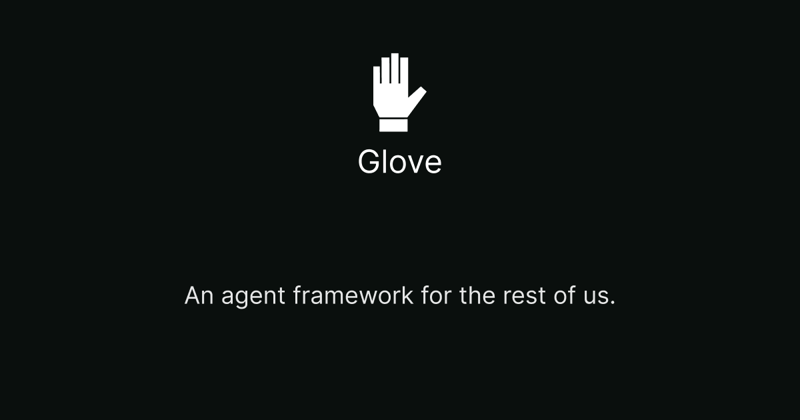

<p align="center">
  
</p>

<h3 align="center">Build entire apps as conversations.</h3>

<p align="center">
  An open-source TypeScript framework for AI-powered apps.<br/>
  You define tools — things your app can do. An AI agent decides when to use them.
</p>

<p align="center">
  <a href="https://glove.dterminal.net/docs/getting-started">Docs</a> &middot;
  <a href="https://glove.dterminal.net">Website</a> &middot;
  <a href="#examples">Examples</a>
</p>

---

## What is Glove?

Traditional apps encode user flows in UI — pages, routes, navigation hierarchies. Glove replaces that wiring with an agent. You define capabilities as **tools**. The agent orchestrates when to call them based on what users ask for.

```
User: "Find me running shoes under $100"
  → Agent calls search_products tool → pushes product grid to display
User: "Add the Nike ones to my cart and check out"
  → Agent calls add_to_cart → calls checkout → pushes payment form → waits for user
```

Works with OpenAI, Anthropic, Google Gemini, OpenRouter, and more.

## Packages

| Package | Description | npm |
|---------|-------------|-----|
| [`glove-core`](packages/glove) | Core agent framework — builder, tools, model adapters, stores | [](https://www.npmjs.com/package/glove-core) |
| [`glove-react`](packages/react) | React hooks, `<Render>` component, `defineTool`, client bindings | [](https://www.npmjs.com/package/glove-react) |
| [`glove-next`](packages/next) | Next.js API route handlers (SSE streaming) | [](https://www.npmjs.com/package/glove-next) |
| [`glove-voice`](packages/glove-voice) | Voice pipeline — STT/TTS/VAD adapters, ElevenLabs integration | [](https://www.npmjs.com/package/glove-voice) |

## Quick Start

### Server-side (Node.js / CLI)

```bash
npm install glove-core
```

```typescript
import { Glove } from "glove-core/glove";
import { Displaymanager } from "glove-core/display-manager";
import { SqliteStore } from "glove-core";
import { createAdapter } from "glove-core/models/providers";
import { z } from "zod";

// 1. Pick a model
const model = createAdapter({
  provider: "anthropic",    // or "openai", "openrouter", "gemini", etc.
  model: "claude-sonnet-4-20250514",
  stream: true,
});

// 2. Create the agent
const app = new Glove({
  store: new SqliteStore({ dbPath: "./glove.db", sessionId: "my-session" }),
  model,
  displayManager: new Displaymanager(),
  systemPrompt: "You are a helpful assistant.",
  compaction_config: {
    compaction_instructions: "Summarize the conversation so far.",
  },
});

// 3. Register tools
app.fold({
  name: "get_weather",
  description: "Get current weather for a city",
  inputSchema: z.object({ city: z.string() }),
  async do(input) {
    const res = await fetch(`https://wttr.in/${input.city}?format=j1`);
    return await res.json();
  },
});

// 4. Run
const agent = app.build();
const response = await agent.processRequest("What's the weather in Tokyo?");
```

### Full-stack (React + Next.js)

```bash
npm install glove-react glove-next
```

**Server** — `app/api/chat/route.ts`:

```typescript
import { createChatHandler } from "glove-next";

export const POST = createChatHandler({
  provider: "anthropic",
  model: "claude-sonnet-4-20250514",
});
```

**Client** — `app/providers.tsx`:

```typescript
"use client";
import { GloveProvider, GloveClient } from "glove-react";

const client = new GloveClient({
  endpoint: "/api/chat",
  systemPrompt: "You are a helpful assistant.",
});

export function Providers({ children }: { children: React.ReactNode }) {
  return <GloveProvider client={client}>{children}</GloveProvider>;
}
```

**Client** — `app/chat.tsx`:

```typescript
"use client";
import { useGlove } from "glove-react";

export function Chat() {
  const { timeline, busy, sendMessage } = useGlove();

  return (
    <div>
      {timeline.map((entry, i) => (
        <div key={i}>
          <strong>{entry.kind === "user" ? "You" : "Agent"}:</strong>{" "}
          {entry.kind === "tool" ? `[${entry.name}]` : entry.text}
        </div>
      ))}
      <input
        onKeyDown={(e) => {
          if (e.key === "Enter") {
            sendMessage(e.currentTarget.value);
            e.currentTarget.value = "";
          }
        }}
        disabled={busy}
      />
    </div>
  );
}
```

## Core Concepts

### Tools

Tools are capabilities your app exposes to the agent. Each tool has a name, description, Zod schema, and an async handler:

```typescript
app.fold({
  name: "search_products",
  description: "Search the product catalog",
  inputSchema: z.object({ query: z.string() }),
  async do(input, display) {
    const results = await catalog.search(input.query);

    // pushAndForget — show UI without blocking the tool
    await display.pushAndForget({
      renderer: "product_grid",
      input: results,
    });

    return results;
  },
});
```

Tools can also **pause and wait** for user input:

```typescript
app.fold({
  name: "checkout",
  description: "Start checkout process",
  inputSchema: z.object({ cartId: z.string() }),
  async do(input, display) {
    const cart = await carts.get(input.cartId);

    // pushAndWait — tool execution pauses until user submits
    const payment = await display.pushAndWait({
      renderer: "payment_form",
      input: cart,
    });

    return await orders.create(cart, payment);
  },
});
```

### Model Providers

Glove supports multiple providers through a unified adapter interface:

| Provider | Env Variable | Default Model |
|----------|-------------|---------------|
| `openai` | `OPENAI_API_KEY` | `gpt-4.1` |
| `anthropic` | `ANTHROPIC_API_KEY` | `claude-sonnet-4-20250514` |
| `openrouter` | `OPENROUTER_API_KEY` | `anthropic/claude-sonnet-4` |
| `gemini` | `GEMINI_API_KEY` | `gemini-2.5-flash` |
| `minimax` | `MINIMAX_API_KEY` | `MiniMax-M2.5` |
| `kimi` | `MOONSHOT_API_KEY` | `kimi-k2.5` |
| `glm` | `ZHIPUAI_API_KEY` | `glm-4-plus` |

```typescript
import { createAdapter } from "glove-core/models/providers";

const model = createAdapter({
  provider: "openai",
  model: "gpt-4.1",
  stream: true,
});
```

Or use the adapter classes directly:

```typescript
import { AnthropicAdapter } from "glove-core/models/anthropic";
import { OpenAICompatAdapter } from "glove-core/models/openai-compat";
```

### Stores

Stores handle conversation persistence. Implement the `StoreAdapter` interface for any backend:

- **MemoryStore** (from `glove-react`) — in-memory, great for prototyping
- **SqliteStore** (from `glove-core`) — persistent, good for server-side agents
- **createRemoteStore** (from `glove-react`) — delegates to your own API endpoints

### Subscribers

Observe agent events in real time:

```typescript
const subscriber = {
  async record(event_type: string, data: any) {
    switch (event_type) {
      case "text_delta":      // streaming text chunk
        process.stdout.write(data.text);
        break;
      case "tool_use":        // tool invocation started
        console.log(`Calling: ${data.name}`);
        break;
      case "tool_use_result": // tool finished
        console.log(`Result: ${data.result.status}`);
        break;
    }
  },
};

app.addSubscriber(subscriber);
```

### Voice

Add real-time voice interaction with `glove-voice`:

```typescript
import { createElevenLabsAdapters } from "glove-voice";
import { useGloveVoice } from "glove-react/voice";

// Set up adapters with server-side token auth
const { stt, createTTS } = createElevenLabsAdapters({
  getSTTToken: () => fetch("/api/voice/stt-token").then(r => r.json()).then(d => d.token),
  getTTSToken: () => fetch("/api/voice/tts-token").then(r => r.json()).then(d => d.token),
  voiceId: "JBFqnCBsd6RMkjVDRZzb",
});

// In your React component
const { runnable } = useGlove({ tools, sessionId });
const voice = useGloveVoice({ runnable, voice: { stt, createTTS } });
// voice.mode: "idle" | "listening" | "thinking" | "speaking"
```

Two turn modes: **VAD** (hands-free with barge-in) and **Manual** (push-to-talk). Token-based auth keeps API keys server-side.

## Architecture

Glove is built on five adapter interfaces. Swap any layer without changing application logic.

```
┌─────────────────────────────────────────┐
│  Agent        — the agentic loop        │
│  PromptMachine — model wrapper          │
│  Executor     — tool runner (Zod+Effect)│
│  Observer     — session tracking        │
│  DisplayManager — UI state machine      │
│  GloveVoice   — voice pipeline          │
└─────────────────────────────────────────┘
       ▼              ▼            ▼
  ModelAdapter    StoreAdapter   VoiceAdapters
  (any LLM)      (any DB)       (STT/TTS/VAD)
```

## Examples

The repo includes five example agents:

### Weather Agent

A simple terminal agent with weather lookup and activity suggestions using Ink.

```bash
pnpm weather:agent
```

### Coding Agent

A full-featured coding assistant with file operations, bash, git tools, and a React web UI.

```bash
# Terminal mode
pnpm coding:agent

# Server + web UI
pnpm coding:server
pnpm coding:client
```

### Next.js Trip Planner

A trip planning agent using `defineTool`, `<Render>`, `renderResult`, and display strategies.

```bash
cd examples/nextjs-agent && pnpm dev
```

### Coffee Shop

An e-commerce coffee ordering experience with product catalog, cart, checkout, and **voice interaction** — built with `defineTool`, `<Render>`, display strategies, and `glove-voice`.

```bash
cd examples/coffee && pnpm dev
```

### Lola

A voice-first movie companion with TMDB-powered tools, SileroVAD, and a cinematic amber/charcoal UI.

```bash
cd examples/lola && pnpm dev
```

## Claude Code Skill

This repo includes an [Agent Skill](https://agentskills.io) that gives Claude Code (and other compatible agents) deep knowledge of the Glove framework — architecture, API reference, patterns from the examples, and common gotchas.

### Install with npx skills

```bash
npx skills add porkytheblack/glove -a claude-code
```

Or install globally (available in all projects):

```bash
npx skills add porkytheblack/glove -a claude-code -g
```

Once installed, Claude Code automatically uses the skill when you work with Glove code. You can also invoke it directly with `/glove`.

### Manual install

Copy the `.claude/skills/glove/` directory into your project's `.claude/skills/` folder.

## Development

```bash
# Install dependencies
pnpm install

# Build all packages
pnpm build

# Typecheck
pnpm typecheck
```

## License

MIT
