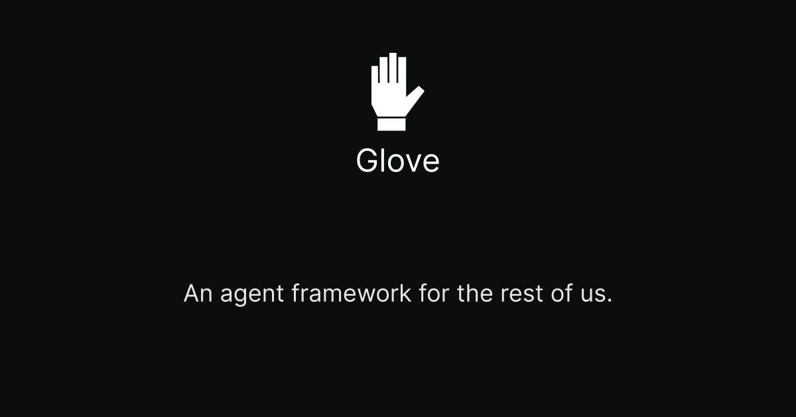

<p align="center">
  
</p>

<h3 align="center">Build entire apps as conversations.</h3>

<p align="center">
  An open-source TypeScript framework for AI-powered apps.<br/>
  You define tools — things your app can do. An AI agent decides when to use them.
</p>

<p align="center">
  <a href="https://glove.dterminal.net/docs/getting-started">Docs</a> &middot;
  <a href="https://glove.dterminal.net">Website</a> &middot;
  <a href="#examples">Examples</a>
</p>

---

## What is Glove?

Traditional apps encode user flows in UI — pages, routes, navigation hierarchies. Glove replaces that wiring with an agent. You define capabilities as **tools**. The agent orchestrates when to call them based on what users ask for.

```
User: "Find me running shoes under $100"
  → Agent calls search_products tool → pushes product grid to display
User: "Add the Nike ones to my cart and check out"
  → Agent calls add_to_cart → calls checkout → pushes payment form → waits for user
```

Works with OpenAI, Anthropic, Google Gemini, OpenRouter, and more. Bridge external tool servers (Notion, Linear, Gmail, ...) via [MCP](#mcp-integration), or add real-time voice with [glove-voice](#voice).

## Packages

| Package | Description | npm |
|---------|-------------|-----|
| [`glove-core`](packages/glove) | Core agent framework — builder, tools, model adapters, stores | [](https://www.npmjs.com/package/glove-core) |
| [`glove-react`](packages/react) | React hooks, `<Render>` component, `defineTool`, client bindings | [](https://www.npmjs.com/package/glove-react) |
| [`glove-next`](packages/next) | Next.js API route handlers (SSE streaming) | [](https://www.npmjs.com/package/glove-next) |
| [`glove-voice`](packages/glove-voice) | Voice pipeline — STT/TTS/VAD adapters, ElevenLabs integration, speech-gated noise robustness | [](https://www.npmjs.com/package/glove-voice) |
| [`glove-voice-native`](packages/glove-voice-native) | React Native / Expo audio backends — on-device mic capture, PCM playback, Silero VAD (onnxruntime-react-native) | [](https://www.npmjs.com/package/glove-voice-native) |
| [`glove-voice-s2s`](packages/glove-voice-s2s) | Speech-to-speech — run a Glove agent on realtime S2S models (OpenAI Realtime / Gemini Live): `RealtimeAgent`, config-carrying `s2sDrivenModel`, typed turn-taking knobs, barge-in with truncation sync | — |
| [`glove-voice-avatar`](packages/glove-voice-avatar) | Live avatars — a face over the S2S stack: `AvatarAdapter` contract + conformance suite, Tavus echo and Anam audio-passthrough adapters, `attachAvatar` bridge | — |
| [`glove-voice-livekit`](packages/glove-voice-livekit) | LiveKit as an adapter — `LiveKitTransport` room leg for realtime agents, plus Tavus/Anam avatars that join your LiveKit room via the avatar datastream protocol | — |
| [`glove-mcp`](packages/glove-mcp) | Model Context Protocol integration — bridge MCP servers' tools, on-demand discovery, opt-in OAuth runner | [](https://www.npmjs.com/package/glove-mcp) |
| [`glove-image`](packages/glove-image) | Agentic image generation — prompt pipelines with enhancer inbetweens, durable characters and scenes, reference images, editing, deterministic assembly, vision review, per-call cost tracking; BYO image-model adapter | [](https://www.npmjs.com/package/glove-image) |
| [`glove-memory`](packages/glove-memory) | Memory layer — entity / episodic / resources / context primitives, schema-first, BYO storage | [](https://www.npmjs.com/package/glove-memory) |
| [`glove-mesh`](packages/glove-mesh) | Inter-agent mesh networking — direct/broadcast/ack messaging on top of the inbox primitive, BYO transport | [](https://www.npmjs.com/package/glove-mesh) |
| [`glove-scratchpad`](packages/glove-scratchpad) | A database emulator for LLM tool use — expose an agent's capabilities as a relational database it queries with one `execute_sql` tool. Resources become tables, `WHERE` pushes arguments down, `information_schema` is discovery, transactions stage outbound effects, and every statement is parsed before any tool runs; default backend is `glove-sql` | [](https://www.npmjs.com/package/glove-scratchpad) |
| [`glove-sql`](packages/glove-sql) | Zero-dependency, pure-JS Postgres-subset SQL engine — runtime-built tables, joins/CTEs/set-ops/subqueries/window functions, serialises to bytes; the default backend for `glove-scratchpad` | [](https://www.npmjs.com/package/glove-sql) |
| [`glove-working-environment`](packages/glove-working-environment) | A persistent, sandboxed working environment for LLM agents — a virtual filesystem where state accumulates across tool calls: write and persist scripts, run them, inspect intermediates, iterate. Scripts see only injected capabilities (`env:fs`, `env:std`, stdlib adapters) — no network, no host fs, no process. Zero-dep core | [](https://www.npmjs.com/package/glove-working-environment) |
| [`glove-env-documents`](packages/glove-env-documents) | Document stdlib adapter for `glove-working-environment` — `env:documents`: compose PDFs and DOCX from one document spec, describe/merge/split/stamp, extract text (PDF text needs the optional `pdfjs-dist` peer). Exports `docx`'s own `Document`/`Packer`/`Paragraph` for anything the spec cannot express | [](https://www.npmjs.com/package/glove-env-documents) |
| [`glove-env-spreadsheets`](packages/glove-env-spreadsheets) | Spreadsheet stdlib adapter for `glove-working-environment` — `env:spreadsheets`: describe a workbook, read sheets as plain-JSON records (formulas, rich text and dates flattened), write/append, bridge to and from CSV. Exports exceljs's own `Workbook` for styling, number formats and formulas | [](https://www.npmjs.com/package/glove-env-spreadsheets) |
| [`glove-env-images`](packages/glove-env-images) | Image stdlib adapter for `glove-working-environment` — `env:images`: describe an image without decoding it into context, resize/convert/crop/rotate/composite, contact sheets | [](https://www.npmjs.com/package/glove-env-images) |
| [`glove-env-slides`](packages/glove-env-slides) | Slide stdlib adapter for `glove-working-environment` — `env:slides`: build PowerPoint decks from a spec and read them back (outline, slide text, speaker notes) through an independent OOXML reader. Exports pptxgenjs's own `PptxGenJS` for custom layouts | [](https://www.npmjs.com/package/glove-env-slides) |
| [`glove-env-archives`](packages/glove-env-archives) | Archive stdlib adapter for `glove-working-environment` — `env:archives`: zip/tar/tar.gz in and out, with traversal- and bomb-safe extraction. No dependencies | [](https://www.npmjs.com/package/glove-env-archives) |
| [`glove-env-media`](packages/glove-env-media) | Media stdlib adapter for `glove-working-environment` — `env:media`: video and audio via ffmpeg — describe, thumbnail, frames, clip, concat, transcode, slideshow | [](https://www.npmjs.com/package/glove-env-media) |
| [`glove-env-render`](packages/glove-env-render) | Rendering stdlib adapter for `glove-working-environment` — `env:render`: rasterize a PDF, deck or Word file to page PNGs so the agent can *look* at what it produced. PDFs and images need nothing installed; a `.pptx` falls back to a layout schematic drawn from its own OOXML geometry | [](https://www.npmjs.com/package/glove-env-render) |
| [`glove-env-motion`](packages/glove-env-motion) | Motion stdlib adapter for `glove-working-environment` — `env:motion`: the agent writes a React component and gets an mp4, an animated GIF, PNG frames or a still. Time is replaced rather than measured, so two runs of the same scene are byte-identical; React Native Reanimated scenes render unchanged | [](https://www.npmjs.com/package/glove-env-motion) |
| [`glove-lisp`](packages/glove-lisp) | A Lisp REPL for LLM tool use — the same resource catalog as `glove-scratchpad`, exposed as functions in a tiny sandboxed Clojure-flavored Lisp behind one `execute_lisp` tool. Branch (decide-and-act) in one call, `def` keeps intermediates out of context, effects are exactly-once by construction (exploration) | [](https://www.npmjs.com/package/glove-lisp) |
| [`glove-continuum-signal`](packages/glove-continuum-signal) | Subprocess-based runtime for triggered (async) and concurrent (warm) agents — discovery, supervision, observability, IPC | [](https://www.npmjs.com/package/glove-continuum-signal) |
| [`glovebox-core`](packages/glovebox) | Authoring kit + `glovebox build` CLI for shipping a Glove agent as a sandboxed container | [](https://www.npmjs.com/package/glovebox-core) |
| [`glovebox-kit`](packages/glovebox-kit) | In-container runtime — WebSocket server, storage adapters, auto-injected skills/hooks | [](https://www.npmjs.com/package/glovebox-kit) |
| [`glovebox-client`](packages/glovebox-client) | Client SDK for talking to a deployed Glovebox server | [](https://www.npmjs.com/package/glovebox-client) |

## Quick Start

### Server-side (Node.js / CLI)

```bash
npm install glove-core
```

```typescript
import { Glove } from "glove-core/glove";
import { Displaymanager } from "glove-core/display-manager";
import { SqliteStore } from "glove-core";
import { createAdapter } from "glove-core/models/providers";
import { z } from "zod";

// 1. Pick a model
const model = createAdapter({
  provider: "anthropic",    // or "openai", "openrouter", "gemini", etc.
  model: "claude-sonnet-4-20250514",
  stream: true,
});

// 2. Create the agent
const app = new Glove({
  store: new SqliteStore({ dbPath: "./glove.db", sessionId: "my-session" }),
  // Or use a simple in-memory store — see glove-core docs
  model,
  displayManager: new Displaymanager(),
  systemPrompt: "You are a helpful assistant.",
  compaction_config: {
    compaction_instructions: "Summarize the conversation so far.",
  },
});

// 3. Register tools
app.fold({
  name: "get_weather",
  description: "Get current weather for a city",
  inputSchema: z.object({ city: z.string() }),
  async do(input) {
    const res = await fetch(`https://wttr.in/${input.city}?format=j1`);
    return await res.json();
  },
});

// 4. Run
const agent = app.build();
const response = await agent.processRequest("What's the weather in Tokyo?");
```

### Full-stack (React + Next.js)

```bash
npm install glove-react glove-next
```

**Server** — `app/api/chat/route.ts`:

```typescript
import { createChatHandler } from "glove-next";

export const POST = createChatHandler({
  provider: "anthropic",
  model: "claude-sonnet-4-20250514",
});
```

**Client** — `app/providers.tsx`:

```typescript
"use client";
import { GloveProvider, GloveClient } from "glove-react";

const client = new GloveClient({
  endpoint: "/api/chat",
  systemPrompt: "You are a helpful assistant.",
  // Optional: fetch session ID from your backend instead of passing one directly
  // getSessionId: () => fetch("/api/session").then(r => r.json()).then(d => d.sessionId),
});

export function Providers({ children }: { children: React.ReactNode }) {
  return <GloveProvider client={client}>{children}</GloveProvider>;
}
```

**Client** — `app/chat.tsx`:

```typescript
"use client";
import { useGlove } from "glove-react";

export function Chat() {
  const { timeline, busy, sendMessage, sessionReady } = useGlove();

  if (!sessionReady) return <div>Loading session...</div>;

  return (
    <div>
      {timeline.map((entry, i) => (
        <div key={i}>
          <strong>{entry.kind === "user" ? "You" : "Agent"}:</strong>{" "}
          {entry.kind === "tool" ? `[${entry.name}]` : entry.text}
        </div>
      ))}
      <input
        onKeyDown={(e) => {
          if (e.key === "Enter") {
            sendMessage(e.currentTarget.value);
            e.currentTarget.value = "";
          }
        }}
        disabled={busy}
      />
    </div>
  );
}
```

## Core Concepts

### Tools

Tools are capabilities your app exposes to the agent. Each tool has a name, description, Zod schema, and an async handler:

```typescript
app.fold({
  name: "search_products",
  description: "Search the product catalog",
  inputSchema: z.object({ query: z.string() }),
  async do(input, display) {
    const results = await catalog.search(input.query);

    // pushAndForget — show UI without blocking the tool
    await display.pushAndForget({
      renderer: "product_grid",
      input: results,
    });

    return results;
  },
});
```

Tools can also **pause and wait** for user input:

```typescript
app.fold({
  name: "checkout",
  description: "Start checkout process",
  inputSchema: z.object({ cartId: z.string() }),
  async do(input, display) {
    const cart = await carts.get(input.cartId);

    // pushAndWait — tool execution pauses until user submits
    const payment = await display.pushAndWait({
      renderer: "payment_form",
      input: cart,
    });

    return await orders.create(cart, payment);
  },
});
```

### Model Providers

Glove supports multiple providers through a unified adapter interface:

| Provider | Env Variable | Default Model |
|----------|-------------|---------------|
| `openai` | `OPENAI_API_KEY` | `gpt-4.1` |
| `anthropic` | `ANTHROPIC_API_KEY` | `claude-sonnet-4-20250514` |
| `openrouter` | `OPENROUTER_API_KEY` | `anthropic/claude-sonnet-4` |
| `gemini` | `GEMINI_API_KEY` | `gemini-2.5-flash` |
| `minimax` | `MINIMAX_API_KEY` | `MiniMax-M2.5` |
| `kimi` | `MOONSHOT_API_KEY` | `kimi-k2.5` |
| `glm` | `ZHIPUAI_API_KEY` | `glm-4-plus` |
| `mimo` | `MIMO_API_KEY` (+ optional `MIMO_BASE_URL`) | `mimo-v2.5` |
| `ollama` | _(none)_ | _(user-specified)_ |
| `lmstudio` | _(none)_ | _(user-specified)_ |
| `bedrock` | `AWS_ACCESS_KEY_ID` | `anthropic.claude-3-5-sonnet-20241022-v2:0` |

```typescript
import { createAdapter } from "glove-core/models/providers";

const model = createAdapter({
  provider: "openai",
  model: "gpt-4.1",
  stream: true,
});
```

#### Local Models

Ollama and LM Studio run locally with no API key. Pass your model name directly:

```typescript
const model = createAdapter({
  provider: "ollama",
  model: "llama3",
  baseURL: "http://localhost:9999/v1", // optional, defaults to :11434
});
```

Or use the adapter classes directly:

```typescript
import { AnthropicAdapter } from "glove-core/models/anthropic";
import { OpenAICompatAdapter } from "glove-core/models/openai-compat";
```

#### Reasoning Models

The OpenAI-compat adapter captures provider-emitted reasoning traces
(`reasoning_content` / `reasoning`) from DeepSeek-R1 / V4, Qwen3-Thinking,
GLM-4.5 / 4.6, Kimi K2, MiniMax M2.5, OpenRouter, and any other OpenAI-shape
endpoint that follows the convention. Set `reasoning: true` for sensible
defaults, or pass an object for fine-grained control:

```typescript
// Capture reasoning into Message.reasoning_content; echo it back on tool turns
// (required by DeepSeek V4 and MiMo for multi-turn tool flows).
createAdapter({ provider: "openai", reasoning: true });

// Hint thinking depth — works with GPT-5 / o-series, GLM, MiniMax, Kimi, etc.
createAdapter({ provider: "openai", reasoning: { effort: "high" } });

// OpenRouter-style unified reasoning object.
createAdapter({
  provider: "openrouter",
  reasoning: { reasoningObject: { effort: "high", max_tokens: 2000 } },
});

// Provider-specific extras (e.g. Qwen3 dashscope's `enable_thinking`).
createAdapter({
  provider: "openai",
  baseURL: "https://dashscope.aliyuncs.com/compatible-mode/v1",
  reasoning: { extraBody: { enable_thinking: true, thinking_budget: 1024 } },
});

// Surface reasoning in the visible message text (wrapped in <think>…</think>).
createAdapter({ provider: "openai", reasoning: { includeInText: true } });
```

The MiMo provider has its own dedicated adapter — keep using
`{ provider: "mimo", reasoningEffort, includeReasoningInText }` for it.

#### Prompt Caching

Enable provider prompt caching with the `cache` option. Pass `true` for sensible
defaults or an object to tune the lifetime:

```typescript
// Anthropic: cache_control breakpoints on the tools + system prefix and the
// latest turn, so each follow-up request reuses the prior context.
createAdapter({ provider: "anthropic", cache: true });

// Tune the cache lifetime (Anthropic / OpenRouter honour the TTL).
createAdapter({ provider: "anthropic", cache: { ttl: "1h" } });

// Same switch on the Next.js handler.
createChatHandler({ provider: "anthropic", cache: true });
```

What the switch does per provider:

| Provider | Behaviour when `cache` is enabled |
|----------|-----------------------------------|
| `anthropic` | `cache_control` ephemeral breakpoints on the stable prefix (tools + system) and the latest turn; `ttl` (`"5m"` / `"1h"`) honoured |
| `bedrock` | `cachePoint` checkpoints after tools, after system, and on the latest turn (cache-capable models only); `ttl` maps onto Bedrock's `CacheTTL` |
| `openrouter` | `cache_control` breakpoints forwarded to the upstream Anthropic / Gemini model |
| `openai`, `gemini`, `minimax`, `kimi`, `glm`, `mimo`, `ollama`, `lmstudio` | Cache automatically — no request-side effect |

Every adapter also reports provider cache usage on
`ModelPromptResult.cache_creation_input_tokens` /
`cache_read_input_tokens` (and on the `model_response` /
`model_response_complete` subscriber events) regardless of the `cache` setting —
inspect `cache_read_input_tokens` to confirm cache hits.

**Cache usage for billing.** The counts flow through the token-accounting path
so downstream clients can bill on them: the per-turn `token_consumption`
subscriber event carries `cache_creation_input_tokens` / `cache_read_input_tokens`
(`TokenConsumptionCounter`), `MemoryStore.getTokenConsumption()` returns the
cumulative session total, and in React `useGlove().stats` exposes the running
cache totals. For Next.js, `createChatHandler` reports provider cache usage on
the SSE `done` event so the client-side agent loop threads it into `stats`.

### Stores

Stores handle conversation persistence. Implement the `StoreAdapter` interface for any backend:

- **MemoryStore** (from `glove-react`) — in-memory, great for prototyping
- **SqliteStore** (from `glove-core`) — persistent, good for server-side agents
- **createRemoteStore** (from `glove-react`) — delegates to your own API endpoints
- **Custom StoreAdapter** — implement the `StoreAdapter` interface for any backend (Redis, Postgres, etc.)

### Subscribers

Observe agent events in real time:

```typescript
import type { SubscriberAdapter } from "glove-core";

const subscriber: SubscriberAdapter = {
  async record(event_type, data) {
    switch (event_type) {
      case "text_delta":      // streaming text chunk
        process.stdout.write(data.text);
        break;
      case "tool_use":        // tool invocation started
        console.log(`Calling: ${data.name}`);
        break;
      case "tool_use_result": // tool finished
        console.log(`Result: ${data.result.status}`);
        break;
    }
  },
};

app.addSubscriber(subscriber);
```

### Voice

Add real-time voice interaction with `glove-voice`:

```typescript
import { createElevenLabsAdapters } from "glove-voice";
import { useGloveVoice } from "glove-react/voice";

// Set up adapters with server-side token auth
const { stt, createTTS } = createElevenLabsAdapters({
  getSTTToken: () => fetch("/api/voice/stt-token").then(r => r.json()).then(d => d.token),
  getTTSToken: () => fetch("/api/voice/tts-token").then(r => r.json()).then(d => d.token),
  voiceId: "JBFqnCBsd6RMkjVDRZzb",
});

// In your React component
const { runnable } = useGlove({ tools, sessionId });
const voice = useGloveVoice({ runnable, voice: { stt, createTTS } });
// voice.mode: "idle" | "listening" | "thinking" | "speaking"
```

Two turn modes: **VAD** (hands-free with barge-in) and **Manual** (push-to-talk). Token-based auth keeps API keys server-side.

**Noise robustness** — in VAD mode, mic audio is speech-gated: it only reaches the STT provider once the VAD confirms speech (with a pre-roll buffer), so background noise is never transcribed. With Silero, short noise bursts are discarded and barge-in only fires on confirmed speech. On by default.

**React Native / Expo** — the pipeline is platform-neutral; only mic capture and playback are platform edges. `glove-voice-native` supplies them for iOS/Android (backed by `react-native-audio-api` and `onnxruntime-react-native`):

```typescript
import { withNativeAudio } from "glove-voice-native";
import { SileroVADNativeAdapter } from "glove-voice-native/silero-vad";

const vad = new SileroVADNativeAdapter();
await vad.init();
const voice = useGloveVoice({ runnable, voice: withNativeAudio({ stt, createTTS, vad }) });
```

**Speech-to-speech, avatars, and LiveKit** — beyond the cascade pipeline, a Glove agent can run directly on realtime S2S models (gpt-realtime / Gemini Live) with [`glove-voice-s2s`](packages/glove-voice-s2s)'s `RealtimeAgent`; wear a live face with [`glove-voice-avatar`](packages/glove-voice-avatar) (Tavus echo, Anam audio-passthrough — `attachAvatar(rt, avatar)`); and ride LiveKit as the room transport with [`glove-voice-livekit`](packages/glove-voice-livekit), where avatars join your LiveKit room as participants. The whole progression is preserved as runnable examples: `examples/layered-voice` → `server-voice` → `s2s-rooms` → `avatar-rooms` → `livekit-rooms`.

### MCP Integration

Bridge tools from any [Model Context Protocol](https://modelcontextprotocol.io) server into a Glove agent with `glove-mcp`. The model can discover and activate MCP servers from a static catalogue mid-conversation via the `discovermcp` subagent.

```typescript
import { mountMcp } from "glove-mcp";
import type { McpAdapter, McpCatalogueEntry } from "glove-mcp";

const ENTRIES: McpCatalogueEntry[] = [
  {
    id: "notion",
    name: "Notion",
    description: "Search, read, and edit pages in a Notion workspace.",
    url: "https://mcp.notion.com/mcp",
    tags: ["docs", "notes", "wiki"],
  },
];

await mountMcp(runnable, {
  adapter: myAdapter,        // implements McpAdapter — getActive / activate / deactivate / getAccessToken
  entries: ENTRIES,
  clientInfo: { name: "my-app", version: "1.0.0" },
});
```

The framework's only auth seam is `McpAdapter.getAccessToken(id)` — return a bearer token however you obtained it. For the MCP authorization spec OAuth flow, `glove-mcp/oauth` ships an opt-in `runMcpOAuth` runner and reference `OAuthStore` implementations.

See the [glove-mcp README](packages/glove-mcp/README.md) and [`examples/mcp-cli`](examples/mcp-cli) for the full picture.

## Glovebox

Glovebox packages a Glove agent as an isolated, network-addressable service. Wrap a built runnable with `glovebox.wrap(runnable, config)`, run `glovebox build`, ship the generated `dist/` (Dockerfile + nixpacks alternative + esbuild server bundle + manifest + bearer key) to any container host. The deployed server exposes one authenticated WebSocket endpoint per session; `glovebox-client` speaks to it. Files cross the wire as `FileRef` (`inline | url | server | s3 | gcs`), never raw bytes.

Five base images cover the common toolsets (`glovebox/base`, `glovebox/media`, `glovebox/docs`, `glovebox/python`, `glovebox/browser`). A storage policy DSL routes inputs and outputs by size — small payloads go inline, larger ones park on the server (or S3) and the client pulls them through the same SDK call. The kit auto-injects an `environment` skill, `workspace` skill, `/output` hook, and `/clear-workspace` hook, and prepends an environment preamble to the agent's system prompt at boot.

```ts
import { glovebox, rule, composite } from "glovebox-core"
import { agent } from "./my-agent"

export default glovebox.wrap(agent, {
  base: "glovebox/media",
  packages: { apt: ["ffmpeg"] },
  storage: {
    outputs: composite([
      rule.inline({ below: "1MB" }),
      rule.localServer({ ttl: "1h" }),
    ]),
  },
})
```

```sh
glovebox build ./glovebox.ts
docker run -p 8080:8080 -e GLOVEBOX_KEY="$(cat dist/glovebox.key)" my-app
```

See the [Glovebox Guide](https://glove.dterminal.net/docs/glovebox) and the per-package READMEs for the full picture: [`glovebox-core`](packages/glovebox/README.md), [`glovebox-kit`](packages/glovebox-kit/README.md), [`glovebox-client`](packages/glovebox-client/README.md).

## Architecture

Glove is built on five adapter interfaces. Swap any layer without changing application logic.

```
┌─────────────────────────────────────────┐
│  Agent        — the agentic loop        │
│  PromptMachine — model wrapper          │
│  Executor     — tool runner (Zod+Effect)│
│  Observer     — session tracking        │
│  DisplayManager — UI state machine      │
│  GloveVoice   — voice pipeline          │
└─────────────────────────────────────────┘
       ▼              ▼            ▼
  ModelAdapter    StoreAdapter   VoiceAdapters
  (any LLM)      (any DB)       (STT/TTS/VAD)
```

## Documentation

Start here:

- [What is Glove?](https://glove.dterminal.net/docs/intro) — the idea in five minutes
- [Installation](https://glove.dterminal.net/docs/installation) — packages, providers, environment variables
- [Quickstart](https://glove.dterminal.net/docs/getting-started) — a working agent in 15 minutes, full-stack or server-only
- [Core Concepts](https://glove.dterminal.net/docs/concepts) — the agent loop, tools, adapters, compaction
- [All Packages](https://glove.dterminal.net/docs/packages) — every package, what it solves, and the snippet that uses it

Reference:

- [Core API](https://glove.dterminal.net/docs/core) · [React](https://glove.dterminal.net/docs/react) · [Next.js](https://glove.dterminal.net/docs/next)
- [Display Stack](https://glove.dterminal.net/docs/display-stack) · [Server-Side Agents](https://glove.dterminal.net/docs/server-side) · [Memory](https://glove.dterminal.net/docs/memory)
- [Working Environment](https://glove.dterminal.net/docs/working-environment) · [Code Execution](https://glove.dterminal.net/docs/code-execution) · [Egress Control](https://glove.dterminal.net/docs/egress)
- [Voice](https://glove.dterminal.net/docs/voice) · [Realtime Voice & Avatars](https://glove.dterminal.net/docs/realtime-voice) · [MCP](https://glove.dterminal.net/docs/mcp) · [Glovebox](https://glove.dterminal.net/docs/glovebox)

For language models:

- [llms.txt](https://glove.dterminal.net/llms.txt) — the docs index, machine-readable
- [llms-full.txt](https://glove.dterminal.net/llms-full.txt) — the whole framework condensed into one file a coding model can work from
- [Agent Skill](https://glove.dterminal.net/docs/agent-skill) — `npx skills add porkytheblack/glove -a claude-code`

## Examples

The repo includes six example agents:

### Weather Agent

A simple terminal agent with weather lookup and activity suggestions using Ink.

```bash
pnpm weather:agent
```

### Coding Agent

A full-featured coding assistant with file operations, bash, git tools, and a React web UI.

```bash
# Terminal mode
pnpm coding:agent

# Server + web UI
pnpm coding:server
pnpm coding:client
```

### Next.js Trip Planner

A trip planning agent using `defineTool`, `<Render>`, `renderResult`, and display strategies.

```bash
cd examples/nextjs-agent && pnpm dev
```

### Coffee Shop

An e-commerce coffee ordering experience with product catalog, cart, checkout, and **voice interaction** — built with `defineTool`, `<Render>`, display strategies, and `glove-voice`.

```bash
cd examples/coffee && pnpm dev
```

### Lola

A voice-first movie companion with TMDB-powered tools, SileroVAD, and a cinematic amber/charcoal UI.

```bash
cd examples/lola && pnpm dev
```

### MCP CLI

A multi-MCP server-side agent — connects to hosted MCP servers (Notion, Linear, Gmail) with the `discovermcp` subagent. Includes reference OAuth-flow CLIs that exercise `glove-mcp/oauth`.

```bash
pnpm mcp:notion-mcp-auth   # one-time OAuth dance
pnpm mcp:cli                # multi-MCP agent with discovery
```

### Document Desk

An agent with a **working environment** instead of a menu of document actions. Drop in a PDF, workbook, deck or image and ask for something — it writes code against your files rather than picking from a fixed tool list. The left pane is the conversation, the right pane is the code the agent is writing as it writes it, and a modal opens the filesystem you are both working in. All five format adapters mounted at once.

```bash
cd examples/document-desk && pnpm dev
```

### Analyst Desk

The eval harness behind [`glove-working-environment`](packages/glove-working-environment) — five document/data scenarios with programmatic checks and a strong-model judge, run against real models over OpenRouter. `pnpm selfcheck` runs the reference solutions with no API calls.

```bash
cd examples/analyst-desk
pnpm selfcheck   # free — proves every scenario is solvable
pnpm start       # the real thing, needs OPENROUTER_API_KEY
```

## Claude Code Skill

This repo includes an [Agent Skill](https://agentskills.io) that gives Claude Code (and other compatible agents) deep knowledge of the Glove framework — architecture, API reference, patterns from the examples, and common gotchas.

### Install with npx skills

```bash
npx skills add porkytheblack/glove -a claude-code
```

Or install globally (available in all projects):

```bash
npx skills add porkytheblack/glove -a claude-code -g
```

Once installed, Claude Code automatically uses the skill when you work with Glove code. You can also invoke it directly with `/glove`.

### Manual install

Copy the `.claude/skills/glove/` directory into your project's `.claude/skills/` folder.

## Development

```bash
# Install dependencies
pnpm install

# Build all packages
pnpm build

# Typecheck
pnpm typecheck
```

## Releasing

Versioning is automated with [Changesets](https://github.com/changesets/changesets) — you never hand-edit a `version`. Publishing to npm is done manually by a maintainer.

1. In your PR, describe the release intent:

   ```bash
   pnpm changeset
   ```

   Pick the affected packages and a bump (patch / minor / major), write a one-line summary, and commit the generated `.changeset/*.md` file alongside your change.

2. On merge to `main`, CI opens (or updates) a **"Version Packages"** PR that applies the bumps and writes each package's `CHANGELOG.md`. Review and merge it — the new versions land on `main`. Dependents of a bumped package are re-versioned for you.

3. **A maintainer publishes manually** from a clean `main`, logged in to npm with 2FA:

   ```bash
   pnpm release
   ```

   This builds the packages and `changeset publish`es everything whose version isn't yet on npm (`workspace:*` deps are resolved to concrete versions automatically). CI does not publish — npm is deprecating the 2FA-bypassing tokens that automated publishing would require.

No changeset? Then the change ships nothing — pure refactors, docs, and tests don't need a release. Versioning runs in `.github/workflows/release.yml`.

## Grants

Glove Voice is supported by ElevenLabs.

<a href="https://elevenlabs.io/startup-grants"></a>

## License

MIT
