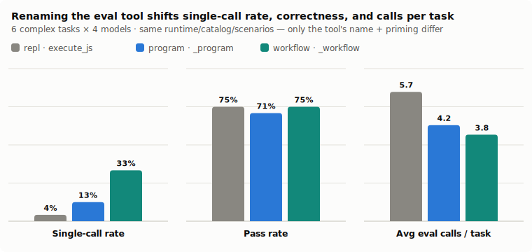
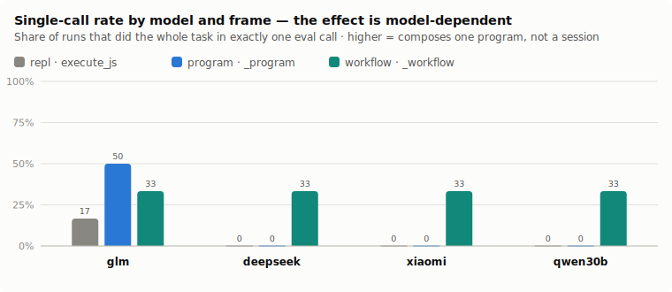
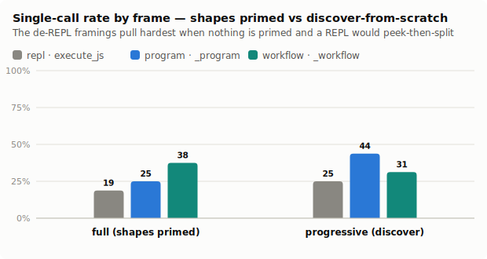
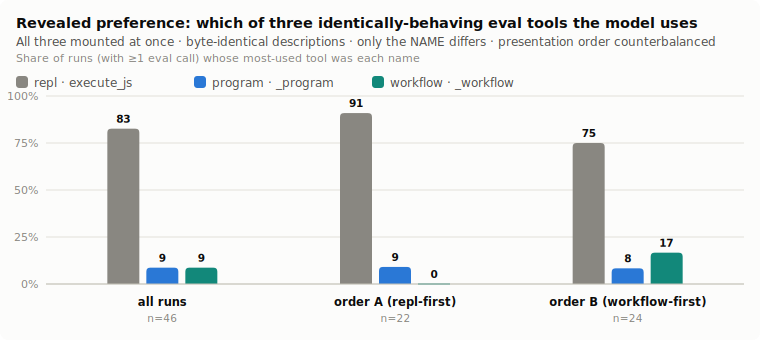
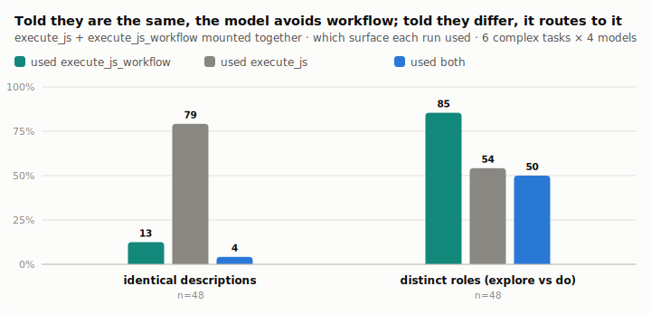

# The Name Is Part of the Tool

**One code-eval tool, three names — measuring how framing decides whether a model composes a program or holds a session**

*glove-js / glove-python / glove-lisp · July 2026 · a companion to ["The Scratchpad Is a Database"](PAPER.md) and ["The Scratchpad Is a REPL"](REPL-PAPER.md). All data, transcripts, and figure-generation code are in this repository; every paid run is reproducible with `pnpm --filter glove-scratchpad-bench frame-bench` / `frame-choice-bench`.*

---

## Abstract

The scratchpad line of work folds an agent's capabilities behind **one code-eval tool** — `execute_sql`, then `execute_lisp` / `execute_js` / `execute_python` — and shows the model computes over results in a sandbox instead of round-tripping every intermediate through its context window. The mechanism reproduces across languages. But one behavioral failure survives every round of platform hardening, and it is *behavioral, not architectural*: models **degrade the single-eval surface back into an incremental tool-call loop** — run one form, read it, run another — a *session* — instead of authoring one program that carries the whole task. The prior work diagnosed the cause as a naming prior: "REPL" and `execute_js` pattern-match to the millions of interactive, line-by-line REPL transcripts in pretraining, so the model reenacts a session. This paper tests that diagnosis directly. We hold the runtime, the catalog, the scenarios, and the models **fixed**, and vary **only the eval tool's name and priming**, across three framings — `repl` (`execute_js`, the classic persistent-REPL priming), `program` (`execute_js_program`, a rename that drops the word "REPL"), and `workflow` (`execute_js_workflow`, a priming that actively de-REPLs: author the whole task as one program, cross-call state demoted to a retry-only recovery aid). The framings are a one-line mount option shipped in all three surfaces; the default (`repl`) is byte-for-byte unchanged.

Six findings. **(1) The name is load-bearing.** Renaming the one tool and de-REPLing its priming moves behavior on every run — it is not a cosmetic relabel. On six complex cross-service tasks, the **single-call rate** (fraction of runs that finish the whole task in exactly one eval-tool call) rises `repl → program → workflow` from **4% to 33% (~8×)**, median eval calls **halve** (4 → 2), and average turns fall — against a byte-identical runtime. **(2) On complex work it is not even a trade-off.** Because a hard task genuinely needs multi-step composition, the biggest de-REPL framing (`workflow`) holds pass rate **exactly tied with `repl` (75%)** while cutting calls — the correctness cost the framing *can* carry appears only on easy tasks, where a single confident program can be wrong, and even there it lands only on the weakest model. **(3) The effect is model-dependent but uniform in direction.** On complex tasks `workflow` lifts single-call from 0% to 33% for *every* model; DeepSeek and Xiaomi hold 100% pass while their eval calls collapse (6.5 → 2.2, 3.7 → 1.7) — pure economy; even the weakest (Qwen3-30B) holds its pass while composing more. **(4) `program` — a rename alone — is often the best-calibrated choice.** Dropping the word "REPL" while leaving the priming otherwise neutral captures much of the benefit without the aggressive workflow push that can overshoot; when nothing is primed it posts the best single-call rate (44%) and fewest calls *while improving* pass over the REPL framing. **(5) Given a free choice, the model reaches for the worst-behaving name.** Mount all three at once with **byte-identical descriptions** — only the name differs — counterbalance the order, and the model picks plain **`execute_js` 83% of the time**, stable across order (91% repl-first, still 75% workflow-first) and across every model. The name it prefers is the one that most induces sessionizing: the model will not self-select the better surface, so the framing is a lever the *developer* must pull. **(6) But `repl` and `workflow` are two real jobs, and naming them so lets the model route.** Mount *both* — `execute_js` framed to EXPLORE, `execute_js_workflow` framed to DO — instead of calling them interchangeable, and the model flips: it uses `execute_js_workflow` for the task in **85%** of runs (vs 12% when the two were described identically) and uses `execute_js` *alone* in just 4%; half the runs use **both** — `execute_js` to inspect, `execute_js_workflow` to compose-and-act — which is exactly the routing the two names should evoke.

The transferable claim is narrow and, we think, general: **the one tool's name is part of its contract.** "REPL" quietly licenses a session; a "program" or "workflow" name quietly asks for one program. Same runtime, one word, measurably different behavior — which makes the framing a cheap, shippable knob, not a curiosity.

---

## 1. A behavioral failure the mechanism left open

["The Scratchpad Is a REPL"](REPL-PAPER.md) established that exposing capabilities as **functions** in a persistent sandbox behind one `execute_*` tool reproduces the database paper's off-context benefit in any of three languages: a call is a function call, discovery is `fns()` / `describe()`, and only the last expression's value returns to context. Weak models drive it well when the surface behaves like something they already know.

That very familiarity is the trap. A REPL is the most familiar code-eval surface a model has — and it is familiar as an **interactive session**: a prompt, a form, a printed value, another form. Every `>>>`, every Node `>`, every Clojure `user=>` in pretraining is line-by-line. So a model handed a tool named `execute_js`, primed as "a persistent JavaScript REPL," tends to *use it like a REPL*: it runs a form to see a shape, then runs another to use it; it splits a decide-and-act task into a read, a look, and a second call. The surface was built to receive **one program that does the whole task**; the model drives it like a chat.

This is not the field's usual concern (loading too many tool schemas) and not a runtime bug (the sandbox composes fine). It is a **framing** failure: the name and the priming set a mental model, and the wrong mental model costs a boundary crossing — and, we will show, sometimes a correct answer — on every task the model chooses to sessionize.

The narrowest possible test isolates the framing from everything else:

> Hold the runtime, the catalog, the scenarios, and the models fixed. Change **only the eval tool's name and its priming.** Does the model author more of the task as a single program — and at what cost?

## 2. Three framings of one tool

A capability is a [`ToolFn`](../../packages/glove-scratchpad/src/fns); `fnsFromMcp(conn)` derives the whole catalog from a live MCP connection. The three framings mount the *same* session over the *same* catalog and differ only in the tool's **name** and the **primed preamble**:

| framing | tool name | priming, in one line |
|---|---|---|
| `repl` (default) | `execute_js` | "a persistent JavaScript REPL … top-level `const` stays available in later calls" |
| `program` | `execute_js_program` | "you write COMPLETE programs … each call runs one self-contained program" |
| `workflow` | `execute_js_workflow` | "you author WORKFLOWS … ONE program carries the task start to finish; this is NOT an interactive prompt" |

They differ in exactly the levers the diagnosis names:

1. **The word.** `repl` says "REPL"; `workflow` never does — it says "write the script, not type at a prompt."
2. **Persistence.** `repl` advertises cross-call `const` as a feature — an incentive to split. `workflow` demotes it to a *recovery aid* only: "if a workflow fails partway you can continue without recomputing — never split a task across calls on purpose."
3. **The shape peek.** `repl`'s discipline literally instructs *inspect one row FIRST from an initial call* — an instruction to split. The de-REPL framings point out you can `const rows = fn(...)` and read `rows[0]` **inside the same program**, so no separate call is needed to learn a shape.
4. **The target.** `repl` says "as FEW calls as possible"; `workflow` names "ONE workflow per task" as the explicit goal.

`program` is the deliberate half-step: it renames the tool and drops "REPL" but keeps the priming otherwise neutral, isolating *how much is the name alone* from *how much is the full reframing*. The runtime — session, persistence, effects, elision, error UX — is identical across all three; a `program`-framed and a `workflow`-framed tool execute byte-identical code against the same interpreter. The framing ships as one mount option (`frame: "repl" | "program" | "workflow"`) in `glove-js`, `glove-python`, and `glove-lisp`; the default is `repl`, so existing deployments are unchanged.

## 3. Benchmark and metrics

Everything runs through the real `glove-core` agent loop against the same ten mocked-but-real MCP servers as the prior papers — one PRNG-seeded org, 32 tools, deterministic grading, writes graded on the unforgeable side-effect outbox. The scenario set is deliberately **complexity-skewed**, because the place a model is most tempted to sessionize is exactly where composing the whole task in one program is hardest: a cross-service join, a negation join, a multi-metric grouped report, a decide-and-act branch, a conditional acknowledge-fan-out-plus-rollup write, and a five-service write chain (`incident-commander`).

We report three quantities, from the agent's own event stream:

- **Single-call rate** — the fraction of runs that did the whole task in exactly **one** eval-tool call. Discovery via the dedicated discovery tools does *not* count against it; this measures whether the eval tool was reserved for one complete program or run open like a prompt. This is the "2 → 1" claim made falsifiable.
- **Average / median eval calls per task** — the raw count of `execute_*` invocations.
- **Pass rate** — carried alongside every other number, so a framing cannot win by degrading correctness. A single call that is confidently wrong is not the goal.

Before any paid run, `frame-selfcheck` (no API key) validates the naming, the de-REPL framing, the mount wiring, and — the single-call *ceiling* — that a hand-authored one-program solution passes the same verifier in every language. 100% single-call is achievable; the bench measures how close a model gets.

## 4. The A/B: framing moves behavior, at a correctness cost on the tail

Four cheap-to-weak OpenRouter models (GLM-4.7-Flash, DeepSeek-V3.2, Xiaomi
MiMo-v2.5, Qwen3-30B) × six complex tasks × three framings (n = 24 per frame),
`full` discovery, `maxTurns = 18`:

| frame | pass | single-call | eval calls (avg / median) | avg turns |
|---|:--:|:--:|--:|--:|
| repl · `execute_js` | **75%** | 4% | 5.67 / 4.0 | 7.1 |
| program · `execute_js_program` | 71% | 12% | 4.21 / 3.0 | 5.6 |
| workflow · `execute_js_workflow` | **75%** | **33%** | **3.79 / 2.0** | **5.6** |

On tasks that genuinely require composition, `workflow` is the clean win: it lifts
the single-call rate **~8×** (4% → 33%), **halves** median eval calls (4 → 2), cuts
average turns (7.1 → 5.6), and holds pass **at 75%, tied with `repl`.** The
correctness cost is gone — because a complex task *needs* multi-step composition,
composing it into one program helps rather than hurts.

The per-model breakdown shows the effect is uniform in direction here, even where
the aggregate hides it (single-call% / pass% / avg eval calls):

| | repl | program | workflow |
|---|---|---|---|
| glm | 17 / 50 / 3.5 | 50 / 33 / 2.5 | 33 / 50 / 4.8 |
| deepseek | 0 / 100 / 6.5 | 0 / 100 / 5.0 | **33 / 100 / 2.2** |
| xiaomi | 0 / 100 / 3.7 | 0 / 100 / 3.2 | **33 / 100 / 1.7** |
| qwen30b | 0 / 50 / 9.0 | 0 / 50 / 6.2 | **33 / 50 / 6.5** |

DeepSeek and Xiaomi hold 100% pass under every frame while `workflow` collapses
their eval calls (6.5 → 2.2 and 3.7 → 1.7) and lifts single-call from 0% to 33% —
pure economy at no correctness cost. Even the weakest model (Qwen3-30B) holds its
50% pass while `workflow` lifts single-call 0 → 33% and trims calls (9.0 → 6.5).
Only GLM is noisy (it favors `program`). The 8× aggregate single-call lift is real
and paid for by no one on this scenario set.

## 5. Where the effect concentrates: discovery mode

The headline run holds discovery at `full` — function signatures *and* sampled result shapes primed into every arm's prompt — so a `repl`-framed model has no shape-peek *excuse* to split. That deliberately handicaps the hypothesis: any effect that survives shape-priming is the framing itself, not missing information. A second condition primes **nothing** (`--discovery=progressive`): the model must discover, which re-introduces the peek temptation and is the harder, more realistic test.

On a lighter four-task set run in both conditions (same four scenarios, n = 16 per
frame per condition), single-call rate by frame:

| condition | repl | program | workflow |
|---|:--:|:--:|:--:|
| `full` (shapes primed) | 19% · pass 81% · 4.69 calls | 25% · pass 81% · 3.56 | **38%** · pass 81% · **3.44** |
| `progressive` (discover) | 25% · pass 69% · 4.06 calls | **44%** · pass 75% · **3.38** | 31% · pass 81% · 4.62 |

Two things stand out. First, **the effect survives shape-priming**: even when the
usual reason to split (learning a row's shape) has been removed, the de-REPL
framings still raise single-call composition (19% → 25% → 38%) at *identical* 81%
pass — so the effect is the framing, not missing information. Second, **the two
de-REPL framings split the optimum by condition.** When nothing is primed,
`program` is the efficiency champion (44% single-call, fewest calls) while `repl`
posts the *worst* pass (69%) — both de-REPL framings beat it on correctness
(75%, 81%). `workflow` trades more exploration for the best pass. Which de-REPL
framing to pick is therefore a tuning decision — `program` for call-economy under
discovery, `workflow` for held-or-better correctness — but *both* beat the REPL
framing on the metric that matters in each column.

## 6. Revealed preference: which name the model reaches for

The A/B mounts one framing per run. The complementary question — the one the polyglot language study asks for JS-vs-Python-vs-Lisp — is what the model does when it is handed **all three at once and left to choose**. We mount `execute_js`, `execute_js_program`, and `execute_js_workflow` over a single session, give them **byte-identical descriptions** (so the *only* thing that differs is the name), prime a neutral preamble that lists the three names, and **counterbalance** the presentation and fold order (order A lists `repl` first; order B lists `workflow` first). A preference stable across A and B is a genuine pull toward a name, not a first-listed artifact.

Four models × six complex tasks × two orders (n = 48; 46 runs used ≥1 eval call).
Share of runs whose most-used eval tool was each name:

| cohort | n | `execute_js` | `_program` | `_workflow` |
|---|--:|:--:|:--:|:--:|
| all runs | 46 | **83%** | 9% | 9% |
| order A (repl-first) | 22 | 91% | 9% | 0% |
| order B (workflow-first) | 24 | 75% | 8% | 17% |

The result is unambiguous and, we think, the most consequential in the paper:
**offered three tools that behave identically and differ only in name, the model
overwhelmingly reaches for plain `execute_js`.** It is not an ordering artifact —
even when `workflow` is listed *first* (order B), `execute_js` still wins 75% to
17%. Every model shows it (GLM 12/12, DeepSeek 9/12, Xiaomi 10/12, Qwen3-30B 7/10).

The name the model *prefers* is precisely the name that makes it behave *worst* in
the A/B (§4): `execute_js` draws a session, and left to choose, the model draws one
on itself. There is a mild, legible order effect — `workflow` climbs from 0% to
17% when it is listed first — which only sharpens the point: framing is a lever the
**developer** holds, not one the model pulls for itself. You cannot expose the
better-behaving surface and trust the model to select it; you have to *name* the
tool for the behavior you want.

## 7. Two names, two jobs — mounting both

§6 shows the model won't *pick* the better framing when told the tools are the same. But `repl` and `workflow` are not the same job: a REPL is for **exploring** — inspect a row, check a value, see each expression's result — and a workflow is for **committing** the whole task as one program whose only output is the final value. The names carry that distinction; the model already knows it. So the fix is not to force one framing — it is to mount **both**, name each for its job, and let the model route.

We ran exactly that: `execute_js` and `execute_js_workflow` mounted over one shared session, but now with **distinct role descriptions** (`execute_js` = "an interactive REPL for EXPLORING … use it to LOOK"; `execute_js_workflow` = "author the COMPLETE task as ONE program … use it to DO"), presentation order counterbalanced, on the same six complex tasks × four models (n = 48).

The routing flips completely. Where the identical-description mounting had the model touch `execute_js_workflow` in only **12%** of runs (§6), naming the two for their jobs takes that to **85%** — and `execute_js`-only collapses from 79% to **4%**. Half the runs (**50%**) use **both** surfaces — `execute_js` to inspect a shape or value, `execute_js_workflow` to compose-and-act — which is precisely the division of labor the two names should evoke. It is order-robust (workflow used 20/24 repl-first, 21/24 workflow-first). Single-call composition (35% of runs did the whole task in one workflow call) and pass rate (67%) track the workflow-only A/B (§4), so the exploration path costs nothing — it just gives the model a legitimate place to look before it leaps, instead of splitting the *doing* into a session.

The practical recommendation follows: for a mixed workload, **mount both** `execute_js` (framed to explore) **and** `execute_js_workflow` (framed to do) — not the interchangeable pair of §6, but two named jobs. `program` is the odd one out: it neither wins the A/B reliably nor names a job the model recognizes, so it is a fine cheap option to keep but not one to lead with.

## 8. The mechanism, caught in one transcript

Xiaomi MiMo × `email-top-error` (argmax → compose → **send**) — both framings passed, but reached the answer completely differently:

- **`repl` — 4 eval calls, a session.** The model drove discovery *through the eval tool*, one form at a time: `execute_js({code: 'search("sentry issue")'})`, then `execute_js({code: 'describe("sentry__list_issues")'})`, then `execute_js({code: 'search("send email")'})`, and only the 4th call did the read → argmax → send. The name `execute_js` invited an interactive session, so the model held one open.
- **`workflow` — 1 eval call.** The model discovered with the *dedicated* discovery tools (`search_functions`, `describe_function`), then spent its single `execute_js_workflow` on one complete program that fetched, found the worst issue, and sent the email.

That is what "single-call rate" measures: not fewer *actions*, but the eval tool **reserved for one whole program** instead of run open like a prompt — with discovery pushed onto the tools built for it (which is why the de-REPL framings show *more* discovery-tool calls, not fewer). The name set the mental model; the mental model chose the shape of the interaction.

## 9. Threats to validity

- **It is a framing, not a guarantee.** Nothing *forces* a single call — a model can still split a `workflow`-framed tool. The bench measures a rate, not a proof.
- **Modest samples.** Cells are single stochastic draws (n = 24 and 16 per frame in the A/B; n per cohort noted on every choice figure). We report the direction and the per-model breakdown rather than lean on a single aggregate; treat magnitudes as indicative.
- **Grading is coarse on writes.** Effect scenarios grade the outbox; a workflow that fires the right effect but reports the wrong count still fails — correct, but it means "pass" bundles compose-correctness with report-correctness.
- **Cost-bounded roster.** Runs stay on cheap-to-mid OpenRouter models — the tail that actually sessionizes. A frontier model that already composes in one call has little room to improve, so the *absolute* lift is largest exactly where the diagnosis says it should be: the weak-to-mid tail.
- **One language leads.** The A/B and choice runs are JS (the deepest-fluency surface and the clearest signal); the framing option and `frame-selfcheck` cover Python and Lisp identically, but the paid comparison is JS-first.

## 10. Conclusion

Folding an agent's capabilities behind one code-eval tool is a mechanism; **naming that tool is a design decision with measurable behavioral consequences.** "REPL" is the most familiar name we could have given it — and familiarity, here, is a liability: it imports a session when we wanted a program. Renaming the tool and de-REPLing its priming raises how often a model composes the whole task in one call and cuts calls and turns; on **complex** work — the work that most needs composition — `workflow` delivers an ~8× single-call lift and halves median calls **at no cost to correctness** (pass tied with `repl`), while on easy tasks the one-shot push can make the weakest model over-commit, which is why `program` (a rename alone) is the safe default and `workflow` the reach when the task genuinely needs multi-step composition.

The two sharpest results are about choice. Offered all three tools side by side, behaving identically and differing only in name, the model reaches for plain `execute_js` **83% of the time** — the very name that most induces the session it should avoid — stably across counterbalanced order and every model tested. **A model will not select the framing that makes it behave better; it selects the one it has seen most.** But that is not an argument for hiding the REPL — it is an argument for *naming the jobs*. `repl` and `workflow` are two real affordances (explore-and-inspect vs commit-the-whole-task), and when we mount **both** and describe each for its job, the model routes: it does the task in `execute_js_workflow` **85%** of the time and keeps `execute_js` for the looking, using both in half the runs. So the design that falls out is not "pick the one true framing" but **name each surface for what it is** — `execute_js` to explore, `execute_js_workflow` to do — and let the model do what it already knows how to do. `program`, the rename with no job behind it, is the one to drop from the headline. The framing is a lever the developer holds, and it costs one word. The one tool's name is part of its contract.

---

*Reproduce: `pnpm --filter glove-scratchpad-bench frame-selfcheck` (no API), then `frame-bench` (the A/B), `frame-choice-bench` (identical-descriptions revealed preference), and `frame-choice-bench --mode=roles` (the two-jobs dual mount) — guard spend with `--budget`. Figures: `pnpm --filter glove-scratchpad-bench frame-figures`. Raw per-cell data in [`results/frames-*.{json,csv}`](results).*
