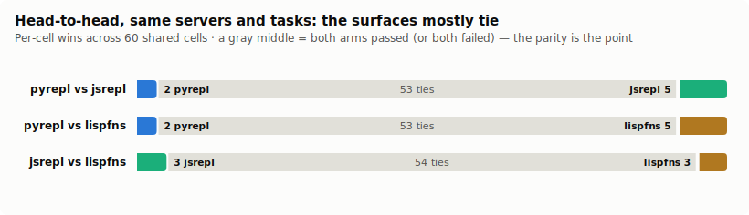

# Is the scratchpad a *Python* REPL? — the fluency bet, third language

*A design exploration building on ["The Scratchpad Is a Database"](PAPER.md),
["Is the Scratchpad a REPL?"](LISP-EXPLORATION.md), and ["Is the Scratchpad a
JavaScript REPL?"](JS-EXPLORATION.md). Status: **live A/B complete** — `pyrepl`
is parity-class with the hardened `jsrepl`/`lispfns` (88% vs 93%, the gap all
shared failure classes). See §7.*

---

## 1. Where this comes from

Three findings carry over, each proven on the previous surface:

1. **One code-eval tool beats folding every tool definition** (SQL) — on
   correctness, context, and cost, because the model computes over results in the
   sandbox instead of round-tripping every intermediate through its context.
2. **The surface need not be SQL** (Lisp) — a Clojure REPL reached graded parity
   and *won* the compositions SQL can't state in one statement (decide-and-act
   branching, session state, negation joins).
3. **Fluency is the whole bet** (JS) — bet on the language the models know best,
   and the weak-model tail that strains on Clojure holds. Hardened, `jsrepl`
   became the **top arm (97%)**, above Lisp (95%) and SQL (92%).

JavaScript is the most-represented language in training data. But for the *shape*
of these tasks — "fetch rows, filter, group, argmax, join, report" — the language
models reach for first is very often **Python**: list comprehensions, f-strings,
`sorted(key=…)`, dict grouping. If fluency is the bet, Python is the other
obvious wager, and the one with the most idiomatic data-manipulation surface.

## 2. The hypothesis

> Expose the same capabilities as **functions in a tiny, sandboxed Python REPL**
> behind one `execute_python` tool. Keep every property the prior work proved
> matters — single tool, in-band discovery, off-context data flow, persistent
> session, bounded output, loud errors — and gain Python's data-manipulation
> idioms (comprehensions, f-strings, `sorted(key=)`) where they read most
> naturally, plus the **keyword-argument call shape** that matches how tools are
> actually described.

`glove-python` (packages/glove-python) is that surface. It consumes the **same
`ToolFn` catalog** as glove-js and glove-lisp function mode (`fnsFromMcp` over the
benchmark's ten servers), so the A/B is pure surface-vs-surface — identical
capabilities, identical effects, only the language differs.

## 3. Property-by-property mapping

| Property | SQL | Lisp | JavaScript | Python |
|---|---|---|---|---|
| One tool | `execute_sql` | `execute_lisp` | `execute_js` | `execute_python` |
| Discovery in-band | `information_schema` | `(tables)`/`(describe)` | `fns()`/`describe()` | `fns()` / `describe("name")` + primed catalog |
| Call a capability | `WHERE col = v` | `(resource {:col v})` | `github.list_pull_requests({state:"open"})` | `github.list_pull_requests(state="open")` — **kwargs** |
| Off-context composition | `JOIN`/`INSERT … SELECT` | `let`/`->>` | array methods | comprehensions + methods inside the program |
| Off-context *storage* | none | `def` | top-level `const`/`let` | top-level names (persist across calls) |
| Bounded output | `LIMIT` + row cap | structural elision | structural elision | structural elision (25 items / 300 chars / depth 6) |
| Exactly-once effects | volatility + pre-resolution | call-by-value | call-by-value | call-by-value (a call fires when its expression evaluates) |
| Write truth is cheap | command tags | command tags | the tool's own return | the tool's own return value |
| Loud, correctable errors | SQL errors | reader/eval errors | parse + runtime errors | parse-time rejects + runtime `PyError` with did-you-mean |

The Python-native difference is the **call shape**: `save_notion_page(title=…,
items=…)` maps a keyword-argument call directly onto the ToolFn's argument object
`{title, items}` — closer to how a tool's parameters are documented than JS's
single-object argument, and exactly what a model writes when it thinks "call this
function."

## 4. The surface, concretely

The whole language is the Python a model reaches for to transform data:

- Assignment + tuple unpacking, `def`/`lambda`, `if`/`elif`/`else`, `for`/`while`
  (`break`/`continue`), `try`/`except`/`finally`, `raise`, ternary `a if c else b`.
- **Comprehensions** (list/dict/set, nested, with `if` filters), **f-strings**,
  slicing (`x[::-1]`), chained comparisons (`0 < n < 10`), `in`/`not in`,
  `and`/`or`/`not`, `//`/`**`/`%`.
- Builtins: `len range enumerate zip sum min max sorted(key=,reverse=) reversed
  map filter any all abs round list dict set tuple str int float bool isinstance
  print`; `str`/`list`/`dict`/`set` methods. Dict rows read as `p["k"]` or `p.k`.

Rejected loudly (a boundary, like the other surfaces): `import`, `class`, `with`,
decorators, `global`/`nonlocal`, `del`, `yield`, `async`. **Dunder attributes are
blocked** — that is Python's classic sandbox-escape surface
(`().__class__.__bases__[0].__subclasses__()`), closed at its first hop because
values are plain JS (no Python object graph to climb).

`parse → validate → run`: [`@lezer/python`](https://github.com/lezer-parser/python)
(pure-JS, no WASM) parses; a CST→AST walk normalizes and rejects out-of-subset
constructs before anything executes; an async tree-walker runs it with a fuel
budget, depth cap, and `AbortSignal`.

## 5. The capability probes (deterministic, no API)

Before any model was in the loop, every benchmark scenario was hand-authored as
the Python program a competent model *should* write and run against the same
seeded world + verifiers (`src/probe-py.ts`). All 11 pass — the surface can
*state* every task:

- **A** `len(github.list_pull_requests(state="open"))` — one-expression aggregate.
- **D** dict group-by → argmax: `sorted(freq.items(), key=lambda kv: kv[1], reverse=True)[0]`.
- **F** `max(issues, key=lambda i: i["count"])` → compose f-string → `email.send_email(...)`.
- **H** decide-and-act in one program: `if len(triggered)==0: slack.post(...)` / `else: email.send(...)`.
- **I/K** session reuse: `all_prs = github.list_pull_requests()` in one call, `len(all_prs)` / a comprehension in the next.
- **J** negation join: `[i["id"] for i in linear.list_issues() if i["state"]=="done" and "merged" not in by_issue.get(i["id"], [])]`.

The comprehension in **J** and the `max(key=…)` in **F** are where Python reads
more naturally than the SQL and (arguably) the JS forms.

## 6. Discovery includes result shape

Like `jsrepl`, `pyrepl` reuses `sampleResultShapes`: each read-only function is
sampled once at mount and its returned row rendered as a type in `describe(...)`
and the primed catalog, so the model needn't guess `.count` vs `.eventCount`.
This is the one affordance table mode gets from `information_schema`; function
mode has it too.

## 7. The A/B — results

Three function-mode arms, **same servers, tasks, seed, and graders** — the only
difference is the language the model writes. 6 models × 10 scenarios × 3 arms =
180 cells, $0.86 total.

| model | tier | jsrepl | lispfns | **pyrepl** |
|---|---|:--:|:--:|:--:|
| GLM-5 | frontier | 10/10 | 9/10 | 9/10 |
| MiniMax M3 | frontier | 9/10 | 10/10 | 9/10 |
| DeepSeek V3.2 | frontier | 9/10 | 10/10 | 9/10 |
| Xiaomi MiMo v2.5 | mid | 10/10 | 10/10 | 9/10 |
| DeepSeek V4 Flash | weak | 10/10 | 10/10 | 10/10 |
| Qwen3 30B A3B | weak | 8/10 | 7/10 | 7/10 |
| **total** | | **56/60 (93%)** | **56/60 (93%)** | **53/60 (88%)** |

Head-to-head on the shared catalog: `pyrepl` 2–5 `jsrepl` (53 ties), `pyrepl`
2–5 `lispfns` (53 ties). Median peak context per cell: `pyrepl` 4,214,
`jsrepl` 3,900, `lispfns` 3,545 — all a fraction of the folded-tools baseline
(~4,800 in the JS run), so the off-context benefit reproduces on Python.

**What the 7 pyrepl misses were — and what they weren't.** None was a language or
sandbox failure; the 11 deterministic probes (§5) prove every task is correctly
expressible in Python, and no cell failed on a parse error, a rejected
construct, or a sandbox block. The graded losses split three ways, all shared
failure classes seen across the arms:

- **Two frontier "id-list" cells** (`high-urgency-triggered`, MiniMax-M3 and
  GLM-5) — the model got the count right but under-listed the ids: MiniMax-M3
  wrote "PD-400, PD-401, PD-403, *and 2 more*" and GLM-5 guessed a sequential run
  (`PD-400…PD-404`) instead of returning what it read. Both landed at 3/5 ids,
  just under the verifier's 70% threshold. The same models pass the cell on
  `jsrepl`; this is one-cell variance on a "report what you read" discipline the
  preamble already states.
- **`open-prs-breakdown` (part b)** — three models got the total (17) right but
  the per-repo *leader* wrong (7/4/8 instead of 9), a grouping/argmax reasoning
  slip. The probe's `sorted(by_repo.items(), key=lambda kv: kv[1], reverse=True)[0]`
  gets it right, so the surface can express it — the models wrote weaker code.
- **The weak tail** (`Qwen3 30B`) — the two remaining misses hit the 24-turn cap
  on the hardest tasks, the identical mode that costs `lispfns` and `jsrepl`
  their weak-tail cells too.

## 8. Verdict

**`pyrepl` is a parity-class fluency surface — competitive with the hardened
`jsrepl` and `lispfns`, 3 cells (5%) back in a 60-cell run, entirely on shared
failure classes rather than anything Python-specific.** The structural claim the
JS work established holds a third time: *function mode over a shared `ToolFn`
catalog reaches the table contract's accuracy, and the language is a fluency
knob, not a capability one.* Frontier and mid models drive the Python surface as
fluently as the JS one (9–10/10 each); the gap is two just-under-threshold
id-list cells and the same weak-model turn-cap tail every arm carries.

Python earns its place for what it *adds*, not for beating the others by points:
the most idiomatic data-manipulation surface of the three (comprehensions,
`sorted(key=)`, dict grouping read most naturally here) and the
**keyword-argument call shape** — `github.list_pull_requests(state="open")` —
that maps a tool's documented parameters straight onto the call, which is exactly
what a model writes when it thinks "call this function." The honest
recommendation mirrors the JS verdict: **offer `pyrepl` as a first-class fluency
surface and pick the language per model/deployment**, since on this matrix the
three are separated by noise, not by capability.

## 9. The sandbox (what a real language costs)

Like `glove-js`, `glove-python` runs untrusted model code as a Turing-complete
language, so it carries a sandbox the SQL and Lisp surfaces don't need. The
Python-specific escape is the dunder chain
(`().__class__.__bases__[0].__subclasses__()[…]`); the gate rejects **every**
`__`-prefixed attribute on read, call, and assignment, and — because values are
plain JS with no Python object graph — there is nothing to climb even one hop.
Each type exposes only a fixed method allowlist; `import`/`open`/`eval`/`exec`/
`__import__`/`getattr`/`globals` are simply not defined. The unit suite covers
the boundary (`pnpm --filter glove-python test`), including the dunder-escape and
`import os` rejection cases.
