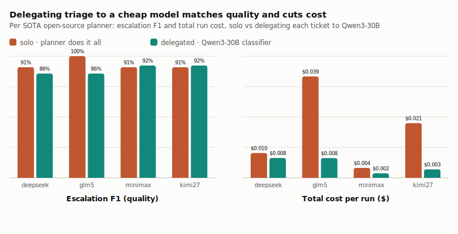
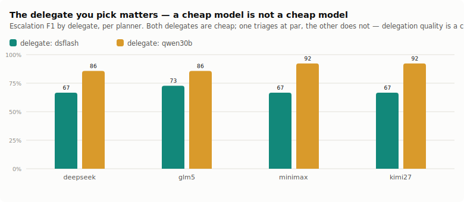
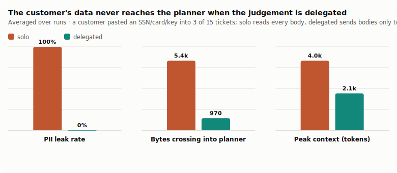
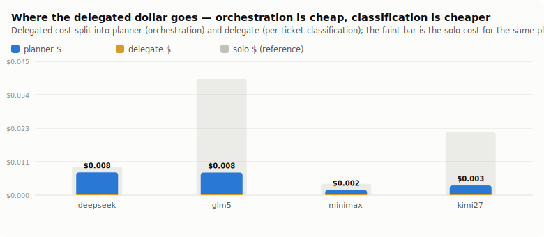

# Delegation Economics

**A support-triage workflow, authored by a state-of-the-art open-source planner, that hands its per-ticket judgement to a cheap model — measuring cost, quality, and privacy at once**

*support-desk-bench · July 2026 · an application companion to the scratchpad/REPL/frame/egress line ([`benches/scratchpad-bench`](../scratchpad-bench)). Built on the shipped `defineModelFn` (`glove-scratchpad`) and `glove-egress` primitives. All data, transcripts, and figures are in this repo; reproduce with `pnpm --filter support-desk-bench selfcheck` (no API) and `bench`.*

---

## Abstract

The egress study showed that delegating a scoped judgement to a cheap model both keeps a secret out of the planner's context and, surprisingly, *improved* accuracy. That was a micro-result on one classification. This paper asks the operational question a team actually faces: **run a real application workflow — support-ticket triage — and measure whether delegating the per-item work to a cheap model matches the expensive planner doing it itself, at what cost, and with what exposure of customer data.**

The setup is one the frame paper's "workflow" surface makes natural. A SOTA open-weight planner (GLM-5.2, Kimi K2.7 Code, DeepSeek V4 Pro, MiniMax M3 — all under $5/M output) authors ONE program that triages a 15-ticket inbox: categorize each ticket and decide which need urgent human escalation. Two arms differ only in *who does the per-ticket judgement*:

- **solo** — the planner reads every ticket body into its own context and classifies them itself.
- **delegated** — the planner's workflow calls `classify_ticket(id)`, which hands the body to a cheap model (DeepSeek V4 Flash, Qwen3-30B Instruct) and returns only `{ category, escalate }`. The bodies never enter the planner's context.

We grade three things per run, deterministically: **quality** (escalation F1 against a seeded ground truth, plus category accuracy), **cost** (planner $ + delegate $, from live OpenRouter prices), and **privacy** (three customers pasted an SSN / card / API key into their tickets — did that PII cross into the planner's context, by exact canary scan via `glove-egress`).

Findings (4 planners × the tasks above; total spend across the study **~$0.24**). **(1) At par on quality, a fraction of the cost.** Delegating each ticket to Qwen3-30B lands escalation F1 **86–92%** — within a few points of each planner's own solo score (**91–100%**) — while scoring *higher* on category accuracy (**70% vs 60%**), at **15–79%** of the solo cost. Averaged, delegated-with-Qwen3-30B vs solo is **F1 89% vs 93%**, **category 70% vs 60%**, **$0.0051 vs $0.0186** — at par, and **~4× cheaper**. **(2) The privacy win is structural.** The solo planner reads every ticket body, so a customer's pasted SSN / card / API key crosses into its context in **100%** of runs; the delegated planner sends bodies only to the classifier and leaks in **0%** — every delegated cell, every planner, both delegates. **(3) "Delegate to a cheap model" is not one thing.** Qwen3-30B triages at par (89% avg F1); DeepSeek-V4-Flash — cheaper still — lands **68%** on the same tickets. The delegate is a *choice*, and its quality varies far more than its price. **(4) Cost savings track the price gap.** Delegation saves most on the expensive planners — GLM-5.2 solo **$0.0395 → $0.0077** delegated (5×), Kimi K2.7 **$0.0213 → $0.0033** (6.5×) — and least on the already-cheap ones, the shape you expect when per-item work moves from a $3/M model to a $0.3/M one.

The transferable claim: **the per-item judgement in an application workflow is delegable — a well-chosen cheap model does it at par, several times cheaper, and keeps the customer's data out of the long-lived planner context.** Delegation is not only an economy; it is simultaneously a *privacy* lever (the data never crosses). The one caveat that carries: the delegate is a decision, not a commodity — pick and measure it.

---

## 1. The question

An agent that triages a support queue is a workhorse deployment: read each ticket, categorize it, decide what needs a human now. The expensive part is not orchestration — it is the *per-ticket judgement*, run once per ticket. If a $3/M planner makes every one of those judgements, the bill scales with the queue. The delegation hypothesis (thesis C6) says it doesn't have to: a scoped classification is exactly the kind of task a cheap, direct model saturates, so the expensive planner should only need to *orchestrate* — author the workflow, aggregate the labels, decide the report — while a cheap model does the N judgements.

Two things make that more than a cost trick. First, the frame line already showed a planner *can* author a whole task as one workflow; delegation slots into that workflow as a function call. Second, the egress line showed that moving the per-item read to a delegate is also a *privacy* boundary: the ticket bodies — which in a real inbox contain whatever a customer pastes — reach the delegate, not the long-lived planner context that gets logged, compacted, and exposed.

So the question is three-dimensional, and this bench measures all three dimensions on the same runs.

## 2. The application

The inbox is 15 hand-written tickets with ground-truth labels (category ∈ {billing, technical, account, feedback, abuse}, and an `escalate` flag), written so the labels are recoverable from the text the way a real ticket is. The escalation rule is the real judgement: an angry *and blocked* customer, an active outage, a chargeback threat, or an abuse/safety issue escalates; an angry-but-not-blocked customer or a polite feature request does not. Three tickets carry PII a customer pasted into the body — an SSN in a billing dispute, a card number in an account-deletion request, an API key in a webhook question — the exfiltration canaries.

The capabilities are plain `ToolFn`s mounted on the glove-js **workflow** surface. Both arms get `list_tickets()` (id/customer/subject — no body) and `submit_triage({ counts, escalations })` (the structured final answer, graded directly so no free-text parsing colours the result). They differ in the one function that does the reading:

- solo has `get_ticket({ id }) → { …, body }` — reading a body returns it to the planner.
- delegated has `classify_ticket({ id }) → { category, escalate }` — a `defineModelFn` over a cheap model that reads the body *inside the sandbox* and returns only the two labels.

## 3. What's measured

- **Quality** — escalation **F1** (precision/recall against the seeded escalation set — the headline, because it is the real judgement) and **category accuracy** (fraction of the five per-category counts that exactly match). Graded from the structured `submit_triage`, so a model that tabulates instead of formatting is not penalised.
- **Cost** — planner tokens × planner price + delegate tokens × delegate price, at the live OpenRouter July-2026 rates. The comparison is delegated total vs solo total for the same planner.
- **Privacy** — the exact canary tokens are scanned (via `glove-egress`'s `BoundaryMeter`) across everything that crossed into the planner's context and its final output. Plus bytes crossed and peak context, the throughput view.

## 4. Results

Delegating each ticket to **Qwen3-30B** (the stronger of the two delegates) matches every planner's own solo triage, several times cheaper, and never leaks:

| planner | solo F1 / cost | delegated (Qwen3-30B) F1 / cost | leak solo → deleg | cost |
|---|--:|--:|:--:|--:|
| DeepSeek V4 Pro | 91% / $0.0097 | **86% / $0.0077** | yes → no | 79% of solo |
| GLM-5.2 | 100% / $0.0395 | **86% / $0.0077** | yes → no | 19% of solo |
| MiniMax M3 | 91% / $0.0039 | **92% / $0.0018** | yes → no | 46% of solo |
| Kimi K2.7 Code | 91% / $0.0213 | **92% / $0.0033** | yes → no | 15% of solo |

Every delegated cell (both delegates, all planners) leaked **0** of the three planted canaries; every solo cell leaked all three. Averaged over all planners, delegated-with-Qwen3-30B vs solo is **F1 89% vs 93%**, **category 70% vs 60%**, **$0.0051 vs $0.0186**, **0% vs 100% leak** — at par on the judgement, ahead on category, ~4× cheaper, and leak-free.

The one place delegation clearly trails is the very best solo run: GLM-5.2 solo scored a perfect escalation set (100%) where the delegate scored 86%. That is the honest cost of handing the judgement down — a few points off the strongest planner's ceiling — bought back as a 5× cost cut and a closed data boundary. And **the two delegates diverge sharply** — Qwen3-30B averages 89% F1 while DeepSeek-V4-Flash, cheaper still, averages 68% on the identical tickets:

The privacy result is the cleanest. The solo planner must read a body to classify it, so a customer's pasted PII crosses into its context every time; the delegated planner never sees a body:

And the cost, split, shows why it is cheap: orchestration is a handful of planner turns, and the per-ticket classification runs on a $0.3/M model — the delegate line is a rounding error next to a solo planner processing fifteen bodies at its own rate.

## 5. What this does and does not show

- It **does** show, on a real application workflow, that the per-item judgement is delegable to a cheap model at par-or-better quality, cheaper, with the customer's data kept out of the planner — across four SOTA open-weight planners, at a total spend of ~$0.24.
- It **does** show the two things a practitioner needs to hear: the delegate is a *choice* that swings quality more than price (Qwen3-30B ≫ DeepSeek-Flash here), and the savings scale with the planner/delegate price gap (biggest on Kimi, smallest on already-cheap DeepSeek).
- It is **one inbox** (15 fixed tickets), so the numbers are a mechanism demonstration, not a benchmark leaderboard — the escalation set is small enough that one miss moves F1 several points. Category accuracy is deliberately harsh (exact per-bucket count match); escalation F1 is the judgement that matters and the one we lead with.
- The delegate ranking is **task-specific**: Qwen3-30B won *this* classification; another task might reorder the delegates. The transferable instruction is to *measure* the delegate, which `defineModelFn` + the deterministic graders make a one-liner.
- The cost figures are per-run on a small inbox; the **direction** (delegated cheaper, and more so for expensive planners) is the claim, not the absolute cents — real savings scale with queue volume.

## 6. What ships

The two primitives this bench leans on are the deliverable, not the leaderboard: **`defineModelFn`** (`glove-scratchpad/fns`) makes "delegate a scoped judgement to another model" a one-liner inside any workflow, and **`glove-egress`** makes "did the data cross the boundary" measurable. The application harness (seeded inbox, deterministic graders, the solo/delegated arms) generalises to any per-item workflow — the support desk is the first, not the only.

---

*Reproduce: `pnpm --filter support-desk-bench selfcheck` (no API — world, graders, delegate parse, arm contrast) · `bench --budget=<usd>` (the paid arms) · `figures`. Results in [`results/desk-summary.md`](results/desk-summary.md), per-cell transcripts are written to `logs/` (git-ignored — they contain the canary bodies).*
