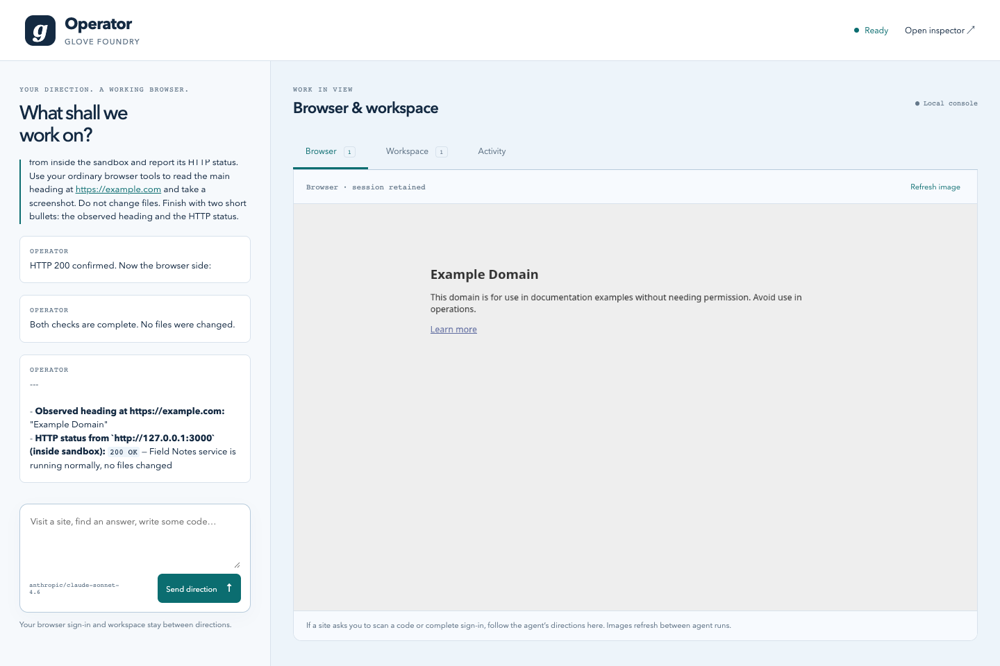
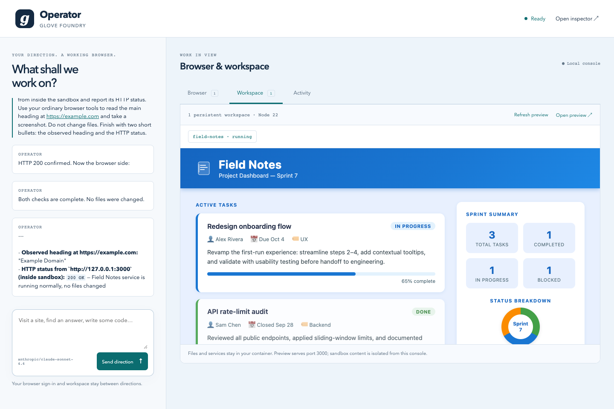

# Operator — a browser and coding agent

A runnable, single-user Foundry application. Give it a direction in the local console: visit a website and find an answer, operate Telegram Web after you sign in, or write an application and run its server in a persistent container.

Browser and sandbox capabilities are **explicit mounts** from `glove-execution`. `glove-core` remains portable. Station is the first backend: Steel supplies the browser, and Station's Docker adapter owns the coding workspace. Foundry owns one managed Station daemon for agent jobs, browser sessions and sandbox resources.

Every Steel session explicitly enables `useProxy: true`, including initial profile creation. Website traffic uses Steel's residential proxy network; provider proxy charges apply. There is no fallback to an unproxied browser. Proxies reduce datacenter-IP blocking but do not guarantee access or bypass sign-in requirements. See [Steel proxies](https://docs.steel.dev/overview/stealth/proxies).




## Start

Requires Node 22.13+, pnpm, Docker running, an OpenRouter key, and a Steel key with residential proxy access. Steel currently requires at least $10 in paid balance on Launch to enable its proxies; promotional credits alone may not qualify. This example uses the workspace packages from this repository.

```sh
pnpm install
pnpm --filter glove-core --filter glove-js --filter glove-execution --filter glove-foundry build
cd examples/foundry-operator
cp .env.example .env.local
# Edit the two *_API_KEY_FILE paths (or supply keys in the process environment).
docker pull node:22-bookworm-slim
pnpm start
```

Open **http://127.0.0.1:4243**. The Foundry inspector is on port 4245, the single managed Station (jobs and resource API) on 4244, and the sandbox preview on 4246. Change `OPERATOR_PORT` to move all four ports together.

The key files contain a single raw key or `NAME=value`. They are credential data, never agent instructions. Their contents are read in host code and never copied into prompts, browser scripts, sandbox environment variables or public assets. `.env.local` can contain only file paths. `.operator/` holds private local state and is gitignored with owner-only directory permissions.

The default model is `deepseek/deepseek-v4.1-flash` through OpenRouter. Set `OPENROUTER_MODEL` to another image- and tool-capable model. The model and cloud browser consume your provider credits when used. The browser has a 15-minute provider lifetime and a 14-minute idle limit; closing Operator releases its browser sessions. Set `STEEL_SESSION_TIMEOUT_MS` only within your Steel plan's limit.

## Connect Telegram

1. Tell the agent: **“I want to use Telegram Web. Open it and get to the QR sign-in screen; I'll scan it.”**
2. The agent discovers the website and its sign-in UI through ordinary browser tools, captures the screen and pauses for you. There is no Telegram-specific route, adapter, startup step or tool.
3. On your phone, open Telegram → Settings → Devices → Link Desktop Device. Scan the QR code in the local console.
4. Once signed in, give a direction such as “Find the message from Alex about tomorrow's meeting and summarize it.” Specify the recipient and message when you want something sent.

Opening Telegram grants no blanket permission to send messages. The agent's instructions require a user direction before sending. This is an instruction-level constraint, not a separate transactional approval system. The browser can act on your signed-in account; use a session you intend the agent to control.

QR codes, logged-in screens, cookies, profile data and conversations must remain private. Documentation images use only public example pages and generated demo projects. They are never captured automatically from your live Telegram session.

Steel's persistent profile retains authentication between sessions. Station maps the private provider profile ID to the agent-visible alias `personal`. Profile changes are saved when Steel releases a session. A live page and its JavaScript state are not a checkpoint; after expiry or restart, ask the agent to reopen the site with the same profile. Telegram may ask for sign-in again depending on its own session policy.

## Give directions

- “Visit this URL, find the pricing differences, and cite the relevant pages.”
- “Search Telegram for the link I received about the venue. Do not send anything.”
- “Build a task board in the sandbox, start the server, and verify the page.”
- “Change the running app's heading and restart its service.”

You can also send any direction from the terminal with `pnpm ask "Your direction"`. No per-site setup is required: Telegram is an example request, not a built-in integration.

Only one console run is active at a time. **Stop** cancels the current run; the agent must inspect state before repeating a possibly completed action. **Activity** shows tool calls; the full local Foundry inspector shows correlated run details. Browser images refresh between runs, avoiding concurrent captures interfering with browser actions.

## How the mounts work

The application configures the shared daemon once:

```ts
daemon: stationDaemon({
  stationId: workerId,
  port: port + 1,
  resources: createResources,
  onReady: connection => writeState("worker-client.json", connection),
})
```

Foundry creates and shuts down that Station instance. The connection file is private host data; the console and agent-side adapters use it without putting credentials into prompts. Omit this application option for a jobs-only daemon.

`agents/operator/agent.ts` calls `mountBrowser` and `mountSandbox` in Foundry's existing `configure` hook. Each mount exposes a single persistent JavaScript scripting tool for that run. The adapter validates operations and resource grants; the interpreter cannot import modules, read host files, access process variables or make arbitrary host requests.

```ts
const browser = mountBrowser(agent, { adapter: browserAdapter });
const sandbox = mountSandbox(agent, { adapter: sandboxAdapter });
context.onCleanup(() => browser.close());
context.onCleanup(() => sandbox.close());
```

The real example registers cleanup immediately after acquiring each adapter, so partial setup also closes scopes. Station browser scopes use `cleanup: "retain"`: the scope closes after the run, while live sessions stay with the host. Sandbox scopes retain their workspaces and services. The next run receives fresh adapters with explicit resource IDs. Neither Foundry's agent definition nor `glove-core` gains browser/sandbox fields.

A browser program can inspect, decide, act and verify without one model round trip per click:

```js
const sessionId = browser.sessions({}).sessionIds[0];
browser.navigate({ sessionId, url: "https://example.com" });
const heading = browser.evaluate({
  sessionId,
  expression: "document.querySelector('h1')?.textContent"
});
browser.screenshot({ sessionId });
heading;
```

Tool functions resolve automatically in the interpreter; `await` is optional. Use `fns("browser")` and `describe("browser__interact")` to discover schemas. Page JavaScript goes through the separately granted `browser.evaluate` operation. Screenshots reach the next model request as native images, after the tool-result batch, and are not inserted as base64 text into the saved conversation.

For loading pages, the agent uses a native selector wait or Foundry's existing top-level `glove_foundry_sleep` tool with `{"kind":"for","duration":"30s","message":"Inspect the retained page without reloading."}`. Sleep suspends the activation and wakes the same conversation; it is not a JavaScript timer inside the browser script. The prompt requires a real wait, fresh resource discovery after waking, and a bounded number of attempts. A loading spinner alone is not evidence of a blocked connection.

## Coding and servers

The workspace runs as non-root UID 1000 in a read-only Node container, with a persistent volume at `/home/node`, a writable temporary directory, CPU/memory/process limits, all Linux capabilities dropped and an explicit Moby seccomp policy. No host directories, API keys or Docker socket are mounted. Docker bridge networking permits package installation and public network requests; this example does not provide an outbound network firewall.

Files are relative to `/home/node/workspace`. A model can write code with `sandbox.writeText({ id, path: "server.mjs", text: source })`, with a shell heredoc through `sandbox.exec`, or with the bounded base64 file API. `cwd` is also workspace-relative; omit it to use the workspace root. Commands return a run ID: poll `sandbox.command` until terminal and check the exit code. Use `sandbox.startService` for long-lived servers, then inspect logs and verify their HTTP response.

The **Workspace** tab previews a server on container port **3000**. The local preview bridge performs a bounded HTTP GET inside the container. It runs on a separate origin and uses a sandboxed frame, so generated app scripts do not share the console's origin. It supports HTTP GET assets up to 256 KiB; WebSocket/HMR, large assets, form POSTs and arbitrary port forwarding are not implemented. The remote Steel browser cannot access this local preview. The agent verifies it with an HTTP fetch inside the sandbox.

Stopping Operator stops its managed daemon, closes browser sessions and stops sandbox processes. Files and service definitions remain. On restart, direct the agent to inspect/restart services as needed. Do not run two Operator hosts against the same state directory.

## Memory and continuation

The agent selects a file-routed `defineMemory` profile through its normal Foundry `components` and `memory` fields. `glove-memory/sqlite` supplies the durable adapters in private `.operator/memory.sqlite`; no memory implementation or Node dependency is added to `glove-core`.

| Subsystem | What it keeps |
| --- | --- |
| Pinned context | Unfinished task checkpoints, acceptance criteria, user constraints, next actions and explicit preferences; refreshed before every model iteration |
| Episodic memory | User requests, decisions and observed results with provenance; structured and embedding-free text search |
| Entity memory | Reusable known people, projects, sites and artifacts with stable identity keys |
| Resource memory | Detailed notes, exact activation requests and archived compaction summaries |

Memory is scoped by workspace, agent instance **and conversation**. It survives daemon/host restarts; separate conversations do not automatically share preferences or tasks. The optional goals and forms subsystems are not mounted in this example. No embedding service is required. Resource search uses `grep`; episodic search uses the SQLite adapter's fuzzy text mode.

The system prompt requires the agent to checkpoint before multi-step work, after important results, before sleep and before its final reply. It updates existing context IDs rather than creating duplicates, retains other unfinished tasks during side requests, and distinguishes observed facts from hypotheses. This is a model instruction, not a guarantee that every run will checkpoint successfully. The host additionally archives each exact activation request before inference and re-injects the current request independently of compaction, even if a run fails.

System and compaction instructions are separate code values in `agents/operator/prompts.ts`. Compaction retains user outcomes, task state, evidence/uncertainty, preferences/authorization, resource references and continuation instructions. It omits repeated logs, obsolete page dumps and redundant narration. The full transcript remains saved; each generated summary is also archived as a resource. Pinned memory is supplied again after compaction, so a lossy summary cannot erase it. Summaries and memory are evidence, not higher-priority instructions.

`ConversationStore` preserves the transcript, native task list and inbox state. Its compaction-pressure counter uses the latest provider-reported prompt/output size plus newly appended content, with a conservative character estimate after restart. It does not sum repeated prompt billing as though those tokens were all in the current context. Usage accounting remains separate. Legacy transcript arrays migrate without deleting messages when first written.

Live verification uses `/api/verify`, which creates a separate conversation and memory namespace. It cannot resume the main conversation. Browser and sandbox resources are still shared by the local single-user host, so the browser/code demo can change its demo files; the memory-only check uses neither resource. To generate fresh documentation screenshots, use a separate fresh `OPERATOR_STATE_DIR` before personal sign-in.

## State lifetimes

| State | Owner | Lifetime |
| --- | --- | --- |
| Instances and conversations | `FileFoundryDataAdapter` | Private local JSON across restarts |
| Glove transcript, task list and inbox | Consumer-owned `ConversationStore` | Private local JSON across runs and restarts |
| Context, episodes, entities and notes | Native SQLite memory adapters | Private database across runs and restarts, scoped per conversation |
| Run queue and traces | Foundry daemon / observer | Current host lifetime |
| Browser profile | Steel | Across released sessions |
| Live browser pages | Station browser manager | Until close, idle expiry or provider expiry |
| Sandbox files | Docker named volume | Until explicit sandbox deletion |
| REPL bindings | Each mounted script session | One agent run |

`foundry.application.ts` opts into `stationDaemon` from `glove-foundry/station`. Its `resources` factory in `lib/resources.ts` creates Steel and Docker adapters inside Foundry's managed daemon. The same Station runs agent jobs and resource APIs; no secondary Station is started. `scripts/start.ts` starts Foundry and the local UI, while `lib/resource-client.ts` accesses the managed daemon over its authenticated API. Provider credentials and worker tokens are host-owned and never part of resource grants. This is a local, single-user example, not a multi-tenant deployment or a publicly exposed console.

## Verify

```sh
pnpm typecheck
pnpm test
# With Operator running: performs a real browser + model + Docker workflow.
pnpm verify
# Isolated real-model memory writes, forced compaction and fresh-activation recall.
pnpm verify:memory
```

The live check reads Example Domain, requests a generated Field Notes app, checks both mount tools were invoked, and independently fetches the running sandbox server. It uses provider credits and writes demo files into the example's workspace. `verify:memory` checks native memory-tool writes, forces actual model compaction, and verifies recall in a fresh activation without changing the main conversation's pinned memory. Documentation captures are taken from the public-data workflow before any personal sign-in.

## Troubleshooting

- **Docker unavailable:** start Docker Desktop and ensure the selected image is present. There is no host-shell fallback.
- **OpenRouter key limit exceeded:** increase the key's allowance or supply another key file, then restart Operator if its configuration changed. Inspect the last tool results before retrying; earlier actions may already have completed.
- **Steel rejects a proxied session:** confirm paid balance and proxy access in Steel. The adapter reports HTTP 403 as `provider_auth`, which can mean a billing restriction rather than a bad API key. Keep `useProxy: true`; after resolving the restriction, send a new direction for a fresh scope. Do not repeatedly retry within a scope that reports an unresolved opening.
- **Browser expired:** ask the agent to reopen the site, then inspect the restored page before repeating work.
- **Unknown browser creation:** reconcile `.operator/steel/<project-id>/.station-remote.json` against Steel before creating another session. Startup releases known orphan session IDs; uncertain IDs require operator reconciliation.
- **Profile bootstrap pending:** inspect `.operator/profile-bootstrap.json` and Steel. If its recorded profile is READY, set its ID in `STEEL_PROFILE_ID` and its project in `STEEL_PROJECT_ID`; do not create a second session blindly.
- **Preview unavailable:** inspect the service's logs and verify it listens on port 3000. Use `sandbox.restartService` after editing code.
- **Restart:** Ctrl-C, then `pnpm start`. Private state remains; deleting `.operator` alone does not delete remote profiles or Docker volumes. Use provider/session and sandbox lifecycle operations first.

References: [Station](https://station.dterminal.net/llms.txt), [Steel profile persistence](https://docs.steel.dev/overview/profiles-api/overview), [mounted execution package](../../packages/glove-execution/README.md). The pinned Moby policy and its license are in [vendor/moby](vendor/moby).
