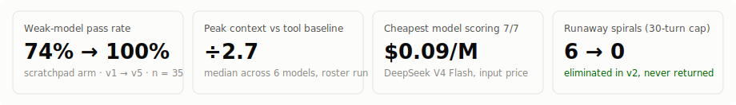
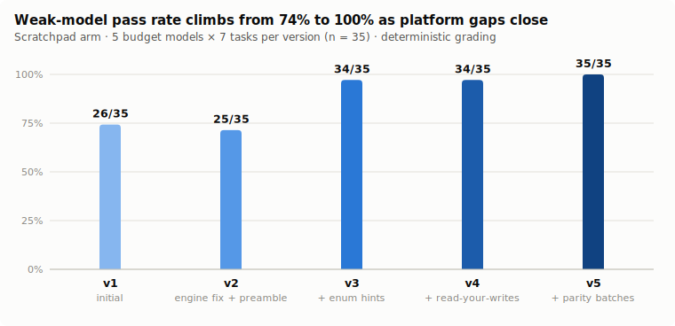
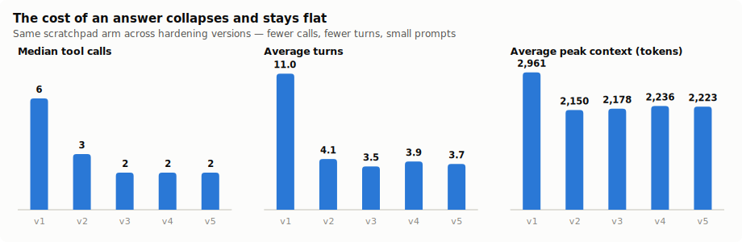
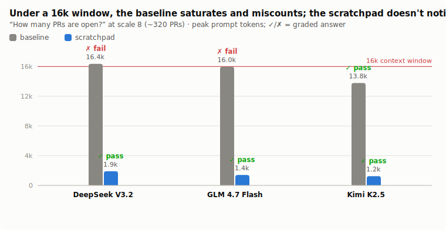
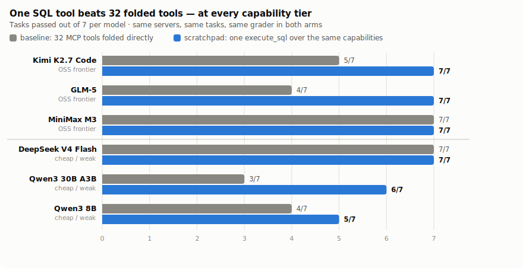
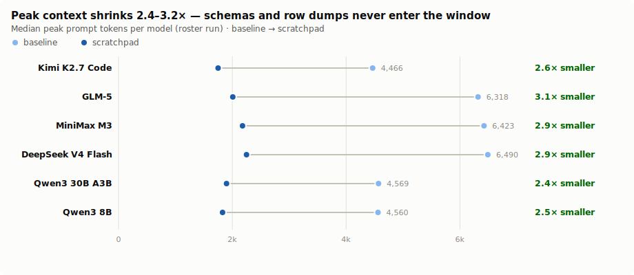
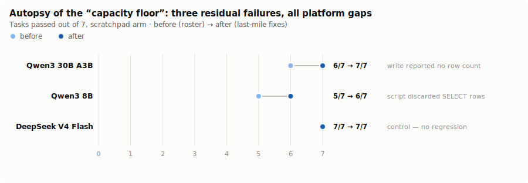

# The Scratchpad Is a Database

**Turning an agent's tools into SQL, and hardening it until the cheapest models drive it like Postgres**

*glove-scratchpad / glove-sql · July 2, 2026 · all data, transcripts, and figure-generation code in this repository*

---



## Abstract

Agents talk to the world through tools, and tools have two costs that grow with the world: every schema sits in the context window whether used or not, and every result streams back verbatim for the model to "eyeball." We test an alternative: expose an agent's capabilities as **tables in a SQL database** behind a single `execute_sql` tool, so discovery happens through `information_schema`, arguments push down as `WHERE` clauses, cross-service composition happens inside `JOIN`s, and only the rows a `SELECT` returns ever enter context.

We built a benchmark of **ten mocked-but-real MCP servers** (GitHub, Linear, Slack, Email, Sentry, PagerDuty, Notion, Jira, Calendar, Filesystem — 32 tools over one deterministic seed world) and ran **seven cross-service tasks** through the real agent loop twice per model: once with all 32 tools folded directly (*baseline*), once with the single SQL surface (*scratchpad*). Runs are graded deterministically; writes are graded on the real side-effect outbox, which cannot be faked.

Three findings. **(1)** The initial comparison was a tradeoff, not a win: the scratchpad always cut peak context 2–4×, but weak models spiralled in the open SQL surface (74% pass, six 30-turn runaways). **(2)** Nearly every weak-model failure traced to a *platform* gap rather than a model limit — most damningly, places where the engine **silently mis-answered where Postgres would error** (an inverted boolean comparison, unknown columns returning NULL, writes reporting no row count). Five rounds of fixes — engine bugs, prompt discipline, SQL-discoverable metadata, read-your-writes, Postgres parity — took the same five budget models from **74% → 100%** with zero spirals, cutting median tool calls from 6 to 2. **(3)** The result generalizes in both directions: on the current OSS frontier (Kimi K2.7, GLM-5, MiniMax M3) the scratchpad arm scores **21/21 vs 16/21** for the tool baseline — even frontier models miscount long tool-result lists — and a **$0.09/M-token model scores 7/7**, indistinguishable from the frontier on these tasks. The one remaining failure across the cheapest tier is a demonstrated comprehension floor, not a mechanics gap.

The transferable lesson is a design stance: **the scratchpad only works if it behaves like the database the model already knows.** Every place it silently deviated from Postgres muscle-memory was a place a weak model failed; every fix that made truth cheaper to see — command tags, read-your-writes, loud errors, in-band discovery — bought more capability than any prompt instruction.

---

## 1. Why a database?

An agent with N integrations conventionally gets N×(tools per integration) tool definitions. This fails in two compounding ways as N grows:

- **Standing cost.** Every tool schema occupies context on every request, relevant or not. Our 10-server world costs the baseline arm ~4–6.5k tokens of peak context *before any work happens*; the scratchpad arm holds ~1.5–2k regardless of how many capabilities are mounted.
- **Marginal cost.** Tool results return *to the model*. A question like "how many PRs are open?" forces the baseline to page an entire PR list through context and count by eyeballing. The data outgrows the window before it outgrows the question.

SQL inverts both. The capabilities become *tables* (`github_pull_requests`, `sentry_issues`, `emails`, …) registered against one engine; the model gets one tool. Selection (`WHERE`), aggregation (`COUNT`, `GROUP BY`), joining across services, and piping one capability into another (`INSERT INTO github_issues SELECT … FROM github_pull_requests`) all execute *inside* the engine. The context window sees the question and the answer — not the corpus in between.

The bet has a cost: SQL is an open surface. A model can write anything, and a weak model can get lost. Section 4 is the story of closing that gap.

### The system under test

`glove-scratchpad` (this repo) implements the emulator over `glove-sql`, a dependency-free Postgres-subset engine:

- **Resources as tables.** `defineResource({name, columns, volatility, select, insert, update, delete})` maps a capability to a table; `mountDatabase(glove, {db})` folds `execute_sql` (+ `explain_sql`) onto the agent and primes it with a compact catalog.
- **Argument pushdown.** Equality/`IN` predicates on declared columns become the tool call's arguments (Steampipe-style); a `requiredKey` column must be equated, and `IN` fans out one call per value.
- **Volatility caching** (`immutable` / `stable` / `volatile`) controls how often the upstream is re-invoked.
- **Transactions as staging.** A lone write fires immediately; `BEGIN … COMMIT` stages several writes for preview — the approval surface for outbound effects.
- **Read-your-writes.** Fired writes fold back into subsequent reads of the same table for the rest of the session (§4.3), while the upstream stays a live view.

## 2. Benchmark design

Everything runs through the real `glove-core` agent loop — streaming adapter, tool execution, compaction — against real MCP servers over `InMemoryTransport`. Nothing above the MCP protocol boundary is mocked.

| Component | Detail |
|---|---|
| World | One PRNG-seeded org (`--seed=1337`): 5 repos, 40+ PRs, 60 Linear issues, Sentry/PagerDuty incidents, Slack, email — cross-linked (PRs close Linear issues, alerts reference services) |
| Servers | 10 MCP servers, 32 tools, exposed identically to both arms |
| **Baseline arm** | all 32 tools folded directly; results stream back verbatim |
| **Scratchpad arm** | one `execute_sql` (+ `explain_sql`) over the same capabilities as tables |
| Tasks | 7 scenarios: counting, filtered lookup, cross-service `JOIN`, group-by/argmax, two write tasks (send email, bulk-open issues), one compose-verify chain |
| Grading | Deterministic verifiers against the seed world; writes graded on the **outbox** (the actual fired side effects) |
| Metrics | turns, model-visible tool calls, ground-truth MCP round-trips, **peak context** (largest single prompt), tokens, compactions, wall time, cost |

Peak context is the leading indicator we report throughout: compaction frequency is its lagging symptom, and it is what determines long-horizon headroom.

## 3. The initial result: a tradeoff, not a blowout

The first full matrix (5 budget models × 7 tasks × 2 arms) split cleanly along three axes:

- **Peak context**: near-universal scratchpad win, 2–4× smaller, because 32 schemas never enter context and only selected rows do.
- **Tool calls**: scratchpad wins big on multi-item and cross-service work (one `JOIN` replaces a 15-call loop) and *loses* on trivial single-tool questions (a discovery tax of 2–3 `information_schema` round-trips).
- **Correctness**: baseline 30/35, scratchpad **26/35** — and the entire gap was six runs that hit the 30-turn cap wandering the SQL surface. Strong models didn't spiral; weak ones did.

So the honest v1 conclusion: the scratchpad wins on context and composition but *hands weak models more rope*. Since the project goal was explicitly "optimize for less-capable models so it's a walk in the park for stronger ones," the spirals were the work.

## 4. Closing the gap: v1 → v5



| version | change | pass | spirals | median tool calls | avg turns | avg peak ctx |
|---|---|:--:|:--:|:--:|:--:|:--:|
| v1 | initial | 26/35 (74%) | 6 | 6 | 11.0 | 2,961 |
| v2 | engine teardown fix + preamble discipline | 25/35 | **0** | 3 | 4.1 | 2,150 |
| v3 | + enum values in the primed catalog | 34/35 (97%) | 0 | 2 | 3.5 | 2,178 |
| v4 | + read-your-writes overlay | 34/35 | 0 | 2 | 3.9 | 2,236 |
| v5 | + Postgres-parity batches A–E | **35/35 (100%)** | 0 | 2 | 3.7 | 2,223 |



### v2 — kill the spirals

Transcript autopsy found the spiral detonator was usually a **platform bug**: a partially-failed table materialization leaked, so the *next valid query* died with `relation "x" already exists`, and the model panic-thrashed. Fixing the engine (idempotent materialization) plus preamble discipline — don't re-read to verify a write; a single write fires directly; be decisive — eliminated all six spirals and halved turns. Pass rate stayed flat, which was itself informative: a model that no longer thrashes **commits to its first interpretation**, exposing enum-value errors (`urgency = 'HIGH'` vs `'high'`; "unresolved" read as `!= 'resolved'`) that thrashing had accidentally stumbled past.

### v3 — put the valid values where the model can see them

Those enum values already existed in column descriptions; the model just couldn't see them, because `information_schema.columns` returned only name+type. Surfacing described columns in the primed catalog (~300 tokens) recovered nine cells: **25 → 34**.

### v4 — make read-your-writes true instead of forbidden

Agents reflexively re-read their own writes. Because scratchpad tables are live views of upstream, a re-query after `INSERT` returned *nothing* — which reads as "my write failed," the root of a 25-call verification spiral in v1. You cannot prompt away an instinct, so we made the instinct correct: a per-session **write overlay** replays fired INSERT/UPDATE/DELETEs over live reads (inserts append, updates patch, deletes drop; deduped by required key). Pass-neutral on the benchmark — the graders score the real outbox — but it removed the footgun class entirely, and it set up the last-mile fixes below.

### v5 — behave like Postgres (the parity audit)

A multi-agent audit (4 code-mappers → 6 parity-lens finders → per-gap adversarial verification → synthesis; 30 confirmed gaps) found one corrosive root pattern: **the engine silently mis-answered where Postgres errors.** Concretely, all reproduced against the engine:

| a droid writes… | the engine did… | Postgres does… |
|---|---|---|
| `WHERE active = 'false'` | matched the **TRUE** rows (`Boolean('false')` is truthy) | matches false rows |
| `SELECT nope FROM t` | returned `{nope: null}` | `column "nope" does not exist` |
| `'Verify: ' + title` | `NaN → NULL` written into data | `operator does not exist … use \|\|` |
| `SELECT ID FROM Emails` | no match (case-sensitive) | folds unquoted identifiers |
| `current_date` | `NULL` (parsed as a column) | today's date |

A silent wrong answer is strictly worse than an error: the model cannot recover from a mistake it cannot see. Batches A–F fixed these loudly (plus a function library — `string_agg`, `date_trunc`, `EXTRACT`, `to_char`, `interval` arithmetic, regex operators, `ON CONFLICT` upsert, `DISTINCT ON`, `RETURNING`, SQL-discoverable required keys and enum values via `is_nullable`/`description`, transaction auto-rollback on error, and rejection of over-broad `UPDATE`/`DELETE` whose predicates can't be pushed down). Engine test suites: glove-sql **111/111**, glove-scratchpad **60/60**.

## 5. Context pressure: the decisive regime

The main matrix runs at a generous 100k-token limit on small result sets — the regime where the baseline's directness is fine. The scratchpad's reason to exist is the other regime. We scaled the world to ~320 PRs and capped context at 16k, then asked the simplest possible question — *"how many PRs are open?"*:



| model | baseline | scratchpad |
|---|---|---|
| DeepSeek V3.2 | ✗ fail — peak 16.4k, window saturated, **miscounted** | ✓ pass — peak 1.9k |
| GLM 4.7 Flash | ✗ fail — peak 16.0k, answered "100" | ✓ pass — peak 1.4k |
| Kimi K2.5 | ✓ pass — peak 13.8k | ✓ pass — peak 1.2k |

The baseline pulls the entire PR list into context to eyeball a count; two of three models get the number **wrong**. The scratchpad answers `SELECT COUNT(*) …` at ~1.5k peak, correct every time. As data outgrows the window, "fetch it all and read it" degrades in cost *and correctness*; "push the computation to the engine" stays flat. (This demo ran on the v1-era engine — the effect is architectural, not a product of the later hardening.)

## 6. Generalization: the OSS frontier and the bargain bin

With the platform hardened, we widened the roster in both directions: the current OSS frontier (Kimi K2.7 Code, GLM-5, MiniMax M3) and the cheapest tool-capable models on OpenRouter (DeepSeek V4 Flash at $0.09/M input, Qwen3 30B-A3B at $0.05/M, Qwen3 8B). 84 runs, both arms, ~$0.27 total.



| model | tier | baseline | scratchpad | peak ctx (base → scr) |
|---|---|:--:|:--:|:--:|
| Kimi K2.7 Code | frontier | 5/7 | **7/7** | 4,466 → 1,750 |
| GLM-5 | frontier | 4/7 | **7/7** | 6,318 → 2,008 |
| MiniMax M3 | frontier | 7/7 | **7/7** | 6,423 → 2,179 |
| DeepSeek V4 Flash | cheap | 7/7 | **7/7** | 6,490 → 2,249 |
| Qwen3 30B A3B | cheap | 3/7 | **6/7** | 4,569 → 1,898 |
| Qwen3 8B | cheap | 4/7 | **5/7** | 4,560 → 1,828 |
| **total** | | **30/42 (71%)** | **39/42 (93%)** | 2.4–3.2× smaller |



Three observations:

1. **Even frontier models fail the tool baseline** — GLM-5 4/7, Kimi K2.7 5/7 — and for the *same* reason weak models did: eyeballing long tool-result lists under context pressure miscounts. The context win is capability-independent; the scratchpad takes every frontier model to 7/7.
2. **A $0.09/M model matches the frontier.** DeepSeek V4 Flash scores 7/7 with the scratchpad. On these tasks, the hardened platform substitutes for model capability at roughly a 10× price difference.
3. **8B/30B models still miss the hardest cells — but fast.** No spirals, 3–4 turn failures: decisive wrong answers from genuine capacity limits, not context/thrash. The platform can't make an 8B model smart; it can stop it from drowning.

## 7. The last mile: autopsy of the "capacity floor"

The roster left three weak-model failures that looked like model limits. Reading the transcripts showed **all three were platform gaps**:

1. **Qwen3-30B reported "I opened 0 new GitHub issues"** — after a *successful* 15-row `INSERT … SELECT`. The result carried no row count; `rows: []` reads as zero. Postgres answers `INSERT 0 15`; we answered nothing.
2. **Qwen3-8B reported "there are no unresolved issues"** — it ran two SELECTs in one call, our error message told it to wrap them in `BEGIN … COMMIT`, it complied, and the COMMIT result **discarded the SELECT rows**. Our own affordance taught the failure.
3. **Qwen3-8B's email had the wrong body** — its first two attempts were *canonical Postgres* (`WITH … INSERT`, `INSERT … SELECT … RETURNING *`) and both failed to parse (data-modifying CTEs unsupported; `RETURNING` eaten as an implicit alias), so it degraded its query until the content was wrong.

The fixes are all product-side: write results now carry the **command tag** (`rowCount`, `insert on "x" fired — 15 row(s)`, per-write counts on COMMIT); scripts return their last SELECT's rows and the multi-statement error steers to one-per-call; `WITH … INSERT/UPDATE/DELETE` parses and resolves; virtual `INSERT…SELECT…RETURNING` works; and a 0-row read carries a nudge to re-check filter values against the discoverable column metadata before concluding the data doesn't exist.



Re-run: **Qwen3-30B 6/7 → 7/7, Qwen3-8B 5/7 → 6/7, DeepSeek V4 Flash 7/7 (control)** — the cheapest tier at 20/21 (95%). The single residual is now a *demonstrated* floor: the prompt asks for the issue's **title** in the email body; Qwen3-8B wrote `'Top error: ' || project`, and `RETURNING` showed it exactly what it sent — it confirmed happily. It failed on **meaning, not mechanics**. That is what an honest floor looks like.

## 8. What the benchmark caught (that tests didn't)

Model-in-the-loop benchmarking found bugs that 100+ unit tests and a deterministic self-check had not, because models exercise the surface the way adversarial fuzzers don't — *plausibly*:

| bug | how a model surfaced it |
|---|---|
| `INSERT…SELECT` column corruption (duplicate `?column?` names collapsed) | a compose task wrote the wrong value into every row's `repo` |
| leaked ephemeral table → `already exists` on the next valid query | weak models panic-thrashed to the 30-turn cap |
| inverted `boolean = 'false'` comparison | a filter returned exactly the wrong rows |
| `RETURNING` parsed as an implicit alias | the single most canonical write-idiom failed |
| own error message steering reads into `BEGIN` scripts that discard rows | a model followed instructions and lost its data |

## 9. Design principles (the transferable part)

1. **A silent wrong answer is the worst possible output.** Every silent-NULL, silent-inversion, silent-truncation became a confident wrong answer downstream. Erroring loudly — with the fix named in the message — is the single highest-leverage property of an agent-facing surface.
2. **Make truth cheap, then trust follows.** Row-count command tags, read-your-writes, and RETURNING exist so the model never has to *wonder* whether something happened. Every verification loop we killed was a place the platform had made truth expensive.
3. **Don't fight instincts — honor them.** Models re-read their writes, write `WITH … INSERT`, and expect `information_schema` to describe the schema. Each time we made the instinct *correct* instead of forbidding it in the prompt, a failure class vanished.
4. **Discovery must be in-band.** Metadata that lives only in the system prompt is invisible to a model that didn't read carefully; metadata queryable through the same SQL surface (`is_nullable`, `description` with enum values) is where the model already looks.
5. **Errors are UX.** "Run one statement per call," "use `||` to concatenate," "this capability supports SELECT, INSERT" — messages that name the next action convert a failed turn into a corrected one. Our own vague message *caused* a benchmark failure.
6. **Optimize for the weakest driver.** Everything above was invisible to frontier models — they route around potholes. The 8B models are the instrumentation that shows where the potholes are. Fixing for them made the road smooth for everyone, at zero cost to the strong.

## 10. Limitations

- **One seed, one run per cell.** n=35–84 per comparison; cells are single samples, so individual cell flips (±1 task) are within noise. The aggregate deltas (74→100, 71% vs 93%, 2.4–3.2× context reduction) are far outside it.
- **Mocked services.** Real MCP servers have latency, auth failures, and pagination the mock world lacks; the benchmark measures the *surface*, not network reality.
- **Seven tasks.** Chosen to span read/aggregate/join/write/compose, but a narrow slice of agent work; no long-horizon multi-session tasks.
- **Preamble co-evolution.** v2–v3 changed both engine and prompt; their contributions are not fully separable (v5's engine-only batches were measured in isolation and were pass-positive).
- **Grader strictness.** Deterministic graders can mark a semantically-adequate answer wrong (and did, for case variants — we count those against the platform, which is the conservative direction).

## 11. Reproducing

```bash
# no API key — validate the layer + engine mechanics:
pnpm --filter glove-scratchpad-bench selfcheck
npx tsx src/probe.ts

# the benchmark (OPENROUTER_API_KEY in repo-root .env; guard spend):
pnpm --filter glove-scratchpad-bench bench --budget=1.50

# regenerate every figure in this paper from the raw results:
npx tsx src/figures.ts
```

Total spend for every experiment in this paper: **≈ $0.85** across 327 model runs. Per-cell JSONL transcripts are git-tracked under `logs/`; the raw results behind every figure are in `results/*.json`; the audit is `results/PARITY-AUDIT.md` and the running lab notebook is `results/FINDINGS.md`.

---

### Appendix A — the seven tasks

| task | shape | write? |
|---|---|---|
| count-open-prs | single-table aggregate | |
| sentry-billing-unresolved | filtered lookup (enum + project) | |
| merged-prs-open-linear | cross-service `JOIN` | |
| busiest-assignee | `GROUP BY` + argmax | |
| high-urgency-triggered | filtered lookup (enum case traps) | |
| email-top-error | argmax → compose → send | ✓ |
| compose-verify-issues | `INSERT … SELECT` fan-out (15 rows) → verify | ✓ |

### Appendix B — version → change map

| version | commits | change |
|---|---|---|
| v1 | `8f37ba2…fc3c3b5` | emulator + benchmark; INSERT…SELECT column-dedup fix |
| v2 | `0996faf` | idempotent materialization; anti-spiral preamble; distractor tables removed; `IN` fan-out |
| v3 | `5420349` | enum values + required keys surfaced in the primed catalog |
| v4 | `6674036` | read-your-writes session overlay |
| v5 | `3c34662…bac7c47` | parity batches A–E: loud errors, idiom resolution, function library, `information_schema` discovery, `RETURNING`, write safety |
| v6 (last mile) | `eb404b3…99e3582` | idiom sweep (batch F); command tags, `WITH…INSERT`, script row return, 0-row nudge |

*Figures are generated by `src/figures.ts` from the raw results; the palette and mark specs follow a validated accessible data-viz method (CVD-checked ordinal ramp, labeled status marks, ink-token text).*
