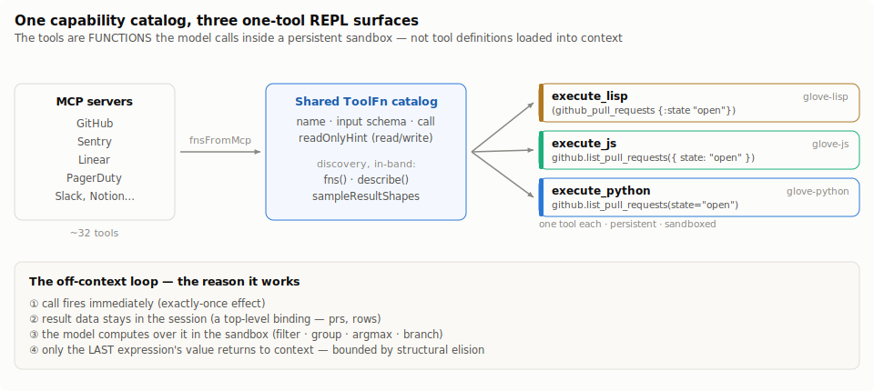
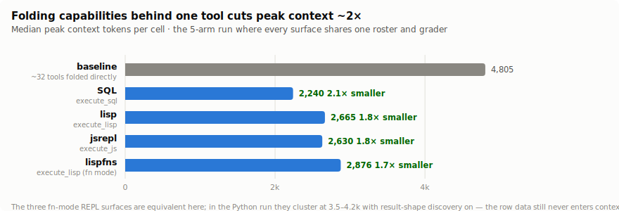
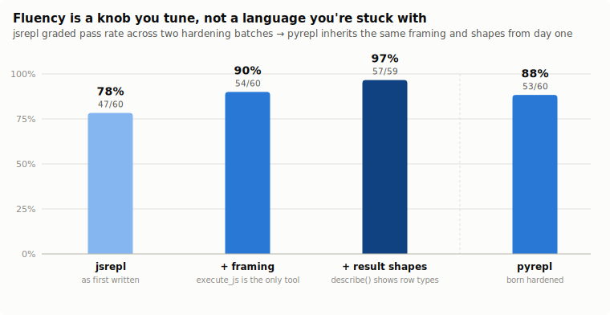
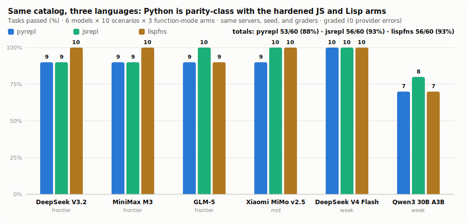
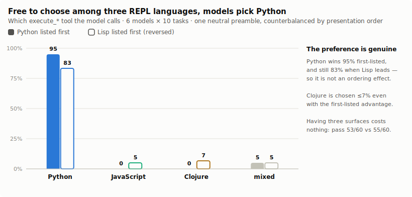
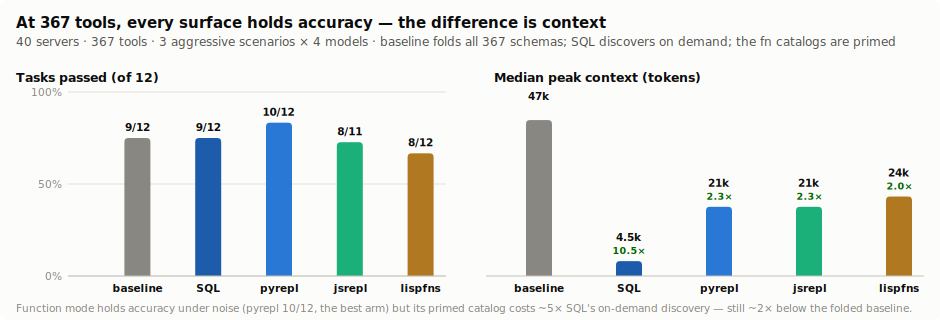
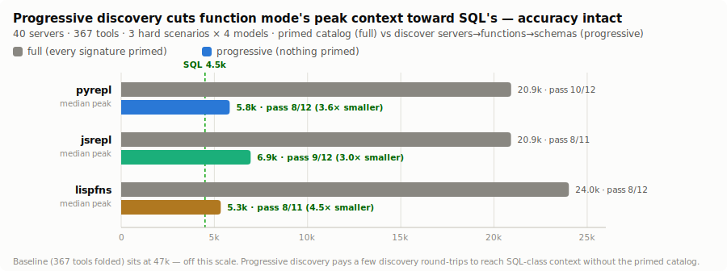
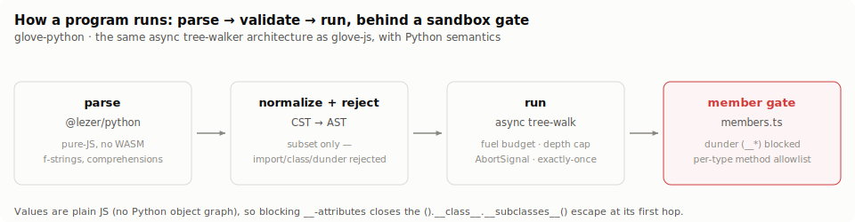

# The Scratchpad Is a REPL

**One capability catalog, three languages — and the finding that fluency is a knob, not a language you're stuck with**

*glove-lisp / glove-js / glove-python · July 10, 2026 · all data, transcripts, and figure-generation code in this repository. A companion to ["The Scratchpad Is a Database"](PAPER.md).*

---



## Abstract

["The Scratchpad Is a Database"](PAPER.md) showed that folding an agent's capabilities behind **one code-eval tool** beats loading dozens of tool definitions — on correctness, on context, and on cost — because the model computes over results in a sandbox instead of round-tripping every intermediate through its context window. That paper's surface was SQL. This one asks whether the *surface* matters: we expose the **same capabilities as functions** in a persistent, sandboxed REPL behind a single `execute_*` tool, and build that surface three times — in **Clojure** (`glove-lisp`), **JavaScript** (`glove-js`), and **Python** (`glove-python`) — over one shared `ToolFn` catalog derived from the same MCP servers. A capability call is a function call; discovery is `fns()` / `describe()`; the data stays in the session and only the last expression's value returns to context.

Six findings. **(1) Function mode reaches the table contract.** Exposing capabilities as plain `ToolFn`s — no columns, no pushdown keys, no volatility classes to declare — tracks the SQL/`ResourceTable` arm cell-for-cell (Lisp function mode 92% vs Lisp table mode 95% on the same run). When the tools are unknown up front, you give up nothing by skipping the table modeling. **(2) Off-context data flow is language-independent.** In a five-arm run on one roster, every folded-behind-one-tool surface holds peak context **~2× below** the tool baseline (SQL 2.1×, Lisp 1.8×, JS 1.8×) — the whole premise reproduces regardless of language. **(3) Fluency is a knob you tune, not a language you're stuck with.** JavaScript's first run face-planted on the weakest model (0/10) for two *framing* reasons — the model called catalog functions as if they were folded tools, and guessed result field names the catalog never showed. Two transcript-driven batches (a preamble that frames `execute_js` as the only tool, then result-shape discovery that samples each read-only function once and shows its row type) took `jsrepl` from **78% → 90% → 97%**, the top arm in the matrix. **(4) The third language inherited the tuning for free.** Python — built last, with the framing and result-shapes baked in from day one — landed at **88% (53/60), parity-class** with the hardened JS and Lisp arms (both 93%) in an apples-to-apples 6-model × 10-task × 3-arm run; its seven misses are shared failure classes (a model under-listing ids just under a grading threshold, an argmax reasoning slip, the weak model's turn-cap tail), not one parse error, rejected construct, or sandbox escape. **(5) Models prefer Python — by revealed preference.** Mount all three languages over one catalog with a neutral preamble and let the model choose, and it reaches for Python in 95% of cells; counterbalanced with the languages presented in reversed order, Python still wins 83% (Clojure 7%, even first-listed) — a genuine preference, not an ordering artifact, and the fluency bet confirmed from the other direction. **(6) At production scale, the discovery mechanism matters as much as the language.** Under 40 servers / 367 tools, function mode holds accuracy (pyrepl the top arm, 10/12) but its *primed* catalog costs ~21k peak context versus SQL's 4.5k — SQL discovers on demand via `information_schema` while the function catalog is front-loaded — still ~2× below the folded baseline's 47k, but ~5× SQL's. A primed catalog that scales with tool count is the one place SQL still wins — so we built the fix and measured it: **progressive, nested discovery** (list servers → a server's functions → one schema, exposed both as REPL functions and as native tools) cuts the fn arms to **5.3–6.9k (3.0–4.5× smaller, next to SQL's 4.5k)** with accuracy within noise, and is neutral-to-positive at small scale (pyrepl 88→92%, lispfns 93→97%) — only the weakest model dips, which `discovery: "auto"` covers.

The transferable lesson extends the database paper's: **the surface must behave like something the model already knows, and it must show the model the shape of what it's working with.** The language is a fluency knob — pick the one your models are most fluent in — but the two things that actually move the weak-model tail, correct *framing* of the one tool and *result-shape discovery*, are surface properties, not language ones.

---

## 1. From a database to a REPL

The database paper established the mechanism and hardened it until $0.09/M-token models drove a SQL surface like Postgres. But it also named SQL's honest limits: conditional branching doesn't reduce to one statement, exactly-once effects needed a whole pre-resolution subsystem, and grammar corners misparse. All three share a root — a SQL program is a string in a big grammar, run by a planner the interface doesn't control.

A REPL removes the planner. The capabilities become **functions**; the model writes a small program that calls them, computes over the results in the sandbox, branches with `if`, and returns one value. The data flows between functions *inside* the program — it does not round-trip through the model's context. Everything the database paper proved matters carries over — one tool, in-band discovery, off-context data flow, persistent session, bounded output, loud correctable errors — and three things SQL couldn't offer come for free: **branching in one program**, **exactly-once effects by construction** (a call fires when its expression evaluates), and **inspection for free** (the program *is* the syntax tree).

The remaining question is the one this paper answers: if the surface is a programming language, *which* language — and does the choice matter?

## 2. One catalog, three languages

A capability is a [`ToolFn`](../../packages/glove-scratchpad/src/fns): a name, an optional input schema (its own — JSON Schema or Zod), and a `call`. `fnsFromMcp(conn)` derives the whole catalog from a live MCP connection, so the three surfaces expose byte-identical capabilities and hit byte-identical effects. There are no columns, no pushdown keys, no volatility classes — the tool's own schema is the contract.

The same catalog mounts on three interpreters, each behind exactly one tool:

| | glove-lisp | glove-js | glove-python |
|---|---|---|---|
| Tool | `execute_lisp` | `execute_js` | `execute_python` |
| Call a capability | `(github_pull_requests {:state "open"})` | `github.list_pull_requests({ state: "open" })` | `github.list_pull_requests(state="open")` |
| Compose | `filter` / `->>` / `group-by` | `.filter` / `.map` / `.reduce` | comprehensions / `sorted(key=)` |
| Store off-context | `(def prs …)` | `const prs = …` | `prs = …` |
| Discovery | `(tables)` / `(describe …)` | `fns()` / `describe("…")` | `fns()` / `describe("…")` |

Discovery is in-band and identical: `fns()` lists the functions, `describe("name")` shows one function's parameters, and — the affordance that closes the field-guessing gap (§5) — `sampleResultShapes` samples each read-only function once at mount and renders its returned row as a type in `describe(...)` and the primed catalog. Python adds the call shape closest to how a tool's parameters are documented: **keyword arguments**, `save_notion_page(title=…, items=…)`, mapping straight onto the ToolFn's argument object.

## 3. The benchmark

Everything runs through the real `glove-core` agent loop against the same ten mocked-but-real MCP servers as the database paper — one PRNG-seeded org, 32 tools, deterministic grading, writes graded on the unforgeable side-effect outbox. The comparison is pure surface-vs-surface: identical capabilities, identical effects, only the language differs.

Ten cross-service scenarios, seven "core" (count, filtered lookup, cross-service join, group-by/argmax, two writes, a compose-verify chain) and three **structural** ones where a REPL's advantages show:

- **`incident-branch`** — decide-and-act: post "all clear" to Slack *or* email a triage list, in one program.
- **`open-prs-breakdown`** — two-part reuse: total open PRs, then the leading repo, reusing a session binding.
- **`reconcile-ghost-issues`** — a negation join: `done` Linear issues not closed by any merged PR.

Before any model is in the loop, every scenario is hand-authored as the program a competent model *should* write and run against the same world + verifiers — the deterministic probes (`probe:lisp` / `probe:js` / `probe:py`, 11 each). They prove each surface can *state* every task, and they gate the paid runs: all 33 pass.

## 4. Function mode reaches the table contract

The database paper's surfaces exposed capabilities as a modeled `ResourceTable` (columns, pushdown keys, volatility). Function mode drops all of that — the `ToolFn` is just a name, a schema, and a call. Does the simpler contract cost accuracy?



No. On the same five-arm run, Lisp **function mode** (`lispfns`, 92%) tracks Lisp **table mode** (`lisp`, 95%) cell-for-cell — 2–5 wins each way, the rest ties. And every folded-behind-one-tool surface holds peak context ~2× below the tool baseline: SQL 2.1×, Lisp 1.8×, JS 1.8×. The off-context benefit — the database paper's central mechanism — is a property of the *approach*, not the language or the table modeling. When the tools are discovered at runtime (an arbitrary MCP server), function mode is the right contract: it costs nothing and needs no schema authoring.

## 5. Fluency is a knob you tune

The bet behind a code surface is **fluency**: the model runs on muscle memory, so the surface must behave like something it already knows. JavaScript is the most-represented language in training data — the strongest fluency bet available. Yet its first run split the roster:



`jsrepl` scored 47/60 (78%) — 8–10/10 on every frontier and mid model, and **0/10** on Qwen3-30B. Every transcript of that weak-model collapse showed the same mechanism: the model emitted a tool call for `github__list_pull_requests` **directly**, as if the catalog names were folded tools, never invoked `execute_js`, got nothing back, and gave up ("there is no available tool named `sentry__list_issues`"). A second cluster, across tiers, guessed result field names the catalog never showed (`.eventCount` when the field was `.count`) — a silently wrong answer.

Neither is a language failure; the probes prove the JS is expressible. Both are *surface* failures, and the same transcript-driven autopsy that hardened SQL (v1→v5) closed them in two batches:

- **Batch 1 — framing.** The preamble now opens with a wrong-vs-right example: the functions are NOT tools, `execute_js` is the ONLY tool, you call the functions *inside* it. Framing alone took `jsrepl` **78% → 90%** and rescued Qwen3-30B from 0 → 5.
- **Batch 2 — result-shape discovery.** `sampleResultShapes` samples each read-only function once and surfaces a TS-like row type in `describe(...)` and the catalog — `sentry__list_issues(…) → { …, count: number, status: "unresolved"|"resolved"|"ignored" }[]`. This is the one thing table mode got from `information_schema` that function mode lacked. It took `jsrepl` **90% → 97%** — the top arm, above Lisp (95%), SQL (92%), and baseline (90%) — carrying Qwen3-30B 5 → 9.

The honest cost: result shapes raised `jsrepl` median peak from 2,630 to 3,793 tokens (still below baseline; the off-context edge narrows from 1.8× to ~1.3×), and are neutral-to-slightly-negative on `lispfns` (which wasn't guessing fields). Enrichment should be matched to where the fluency actually strains — on for the JS/Python field-guessing, off where Lisp function mode doesn't need it.

## 6. The Python A/B — the third language, apples-to-apples

Python was built last, with both fixes baked in from day one: the framing preamble and result-shape discovery, plus the keyword-argument call shape. The question is whether a third language, hardened by construction, lands where the tuned JS and Lisp arms do. We ran all three function-mode arms — `pyrepl`, `jsrepl`, `lispfns` — on the same 6 models × 10 scenarios, same servers, seed, and graders (180 cells, $0.86, 0 provider errors):



`pyrepl` scored **53/60 (88%)** against `jsrepl` and `lispfns` at **56/60 (93%)** each — 9–10/10 on every frontier and mid model, the same weak-tail dip on Qwen3-30B (7/10) that costs the other arms their cells too. Head-to-head on the shared catalog, the surfaces mostly *tie*:


Across the 60 shared cells, `pyrepl` and `jsrepl` differ on 7 (2–5), `pyrepl` and `lispfns` on 7 (2–5), `jsrepl` and `lispfns` on 6 — the rest are ties. The parity is the point.

**What the 7 pyrepl misses were — and what they weren't.** None was a language or sandbox failure: no cell failed on a parse error, a rejected construct, or a blocked attribute, and all 11 probes pass. The losses split three ways, every one a class the other arms share:

- **Two frontier "id-list" cells** (`high-urgency-triggered`) — the model got the count right but under-listed the ids: MiniMax-M3 wrote "PD-400, PD-401, PD-403, *and 2 more*"; GLM-5 guessed a sequential run (`PD-400…PD-404`) instead of returning what it read. Both landed at 3/5 ids, just under the verifier's 70% threshold. The same models pass on `jsrepl` — one-cell variance on a "report what you read" discipline the preamble already states.
- **`open-prs-breakdown` (part b)** — three models got the total right but the per-repo *leader* wrong, a grouping/argmax slip. The probe's `sorted(by_repo.items(), key=lambda kv: kv[1], reverse=True)[0]` gets it right; the models wrote weaker code.
- **The weak tail** — Qwen3-30B's remaining misses hit the 24-turn cap on the hardest tasks, the identical mode that costs `jsrepl` and `lispfns` their weak-tail cells.

Python earns its place not by beating the others — on this matrix the three are separated by noise — but by what it *adds*: the most idiomatic data-manipulation surface of the three (comprehensions, `sorted(key=)`, dict grouping read most naturally here) and the keyword-argument call shape that maps a tool's documented parameters straight onto the call.

## 7. Preference: which language do models reach for when free?

The three surfaces are equivalent on accuracy — so given a free choice, which does
a model pick? We built a **polyglot** arm: one glove with `execute_python`,
`execute_js`, and `execute_lisp` all mounted over the same catalog, a neutral
preamble presenting the three as equals, "pick the one you're most fluent in." The
revealed preference is which `execute_*` the model actually calls (`toolMix`).



The answer is emphatic: **Python.** With Python listed first, models chose it in
57 of 60 cells (95%). The obvious objection is an ordering artifact — Python was
simply listed first — so we ran the study again **counterbalanced**, with the
languages presented in reversed order (Lisp first, Python last). Python still won
**50 of 60 cells (83%)**; Clojure was chosen 7% even with the first-listed
advantage, and JavaScript 5%. A small ordering effect exists (Python 95% → 83%),
but the dominant signal survives it: on data-shaped tasks, models reach for Python
whether it is offered first or last. This is the fluency bet (§5) confirmed by
*revealed preference* rather than pass rate — the same conclusion from the other
direction. Having three surfaces mounted at once costs nothing: pass 53/60 and
55/60, matching the single-surface arms.

## 8. Under production noise: 40 servers, 367 tools

Everything so far ran against ten servers and 32 tools. Real agent platforms carry
*dozens* of MCP servers whose tools mostly don't matter for any task. Following the
database paper, we mounted a distractor fleet — **40 servers, 367 tools** — and ran
the three hardest scenarios (a five-effect incident-commander chain, a
grouped-negation audit, a needle sweep where 3 of 72 entities matter) across four
models. The function-mode arms carry *all 367 tools* as functions.



Two honest findings, one good and one a real cost:

- **Function mode holds accuracy under noise.** `pyrepl` was the *most* accurate arm
  (10/12), above baseline and SQL (9/12 each); `jsrepl`/`lispfns` held at 8/11–8/12.
  The 367-function catalog didn't drown the model — discovery and computation still
  land on the right entities. (Unlike the database paper's 11-model run, the folded
  *baseline* did not collapse on accuracy here — with four mostly-frontier models it
  held 9/12 — but at a cost the next point makes plain.)
- **The primed catalog is function mode's scaling tax.** This is where the fn-catalog
  approach pays for its simplicity: it *primes every signature*, so at 367 tools the
  REPL arms carry a **~21–24k-token** peak context, versus SQL's **4.5k**. SQL wins
  here because `information_schema` is discovered *on demand* — the catalog never
  enters context until queried — while the function catalog is front-loaded. The REPL
  arms are still **~2× below the folded baseline's 47k**, so the off-context benefit
  holds against tool-folding; but against SQL's on-demand discovery, function mode is
  **~5× larger**. The mitigation is obvious: make the function catalog *discoverable*
  rather than fully primed — trade a round-trip for the context, exactly the tradeoff
  SQL already makes. So we built it and measured it.

### The fix, measured: progressive discovery

We made discovery **nested and lazy**: nothing is primed — not even the server list.
The model finds its capabilities in three tiers — **list the servers**, then **list
one server's functions**, then **read one function's schema** — exposed two ways so
it fits both capability tiers. They are REPL functions (`servers()` / `fns("server")`
/ `describe("name")`), so a capable model scripts the whole sweep in one program; and
they are native tools (`list_servers` / `list_functions` / `describe_function`), so a
weaker model fires a batch, reads the results into context, then writes one program.
A `discovery: "progressive" | "full" | "auto"` knob picks the regime; progressive is
the default. Re-running the same 367-tool matrix with progressive discovery:



**Peak context collapses toward SQL's, and accuracy holds.** The fn arms drop from
~21–24k to **5.3–6.9k median peak — 3.0–4.5× smaller**, landing next to SQL's 4.5k
on-demand line and ~8× under the folded baseline. Accuracy is within noise across the
36-cell matrix (pyrepl 10→8/12, jsrepl 8→9/12, lispfns 8→8/12). The models used the
tiers exactly as intended — across the run, ~11 `list_servers`, ~30 `list_functions`,
and 6–22 `describe_function` calls found the 3–4 functions each task needed out of 367.

**And it doesn't cost small-scale accuracy — it slightly helps.** The worry with
"nothing primed" was the weak tail (the 97% JS result leaned on the primed catalog).
Re-running the 32-tool core suite progressive vs full: pyrepl **88% → 92%**, lispfns
**93% → 97%**, jsrepl flat — at *lower* peak (3.2–3.8k vs 3.5–4.2k). Removing the
catalog clutter *helped* the frontier and mid models (each 9→10/10) because they
discover precisely what they need. The one honest casualty is the weakest model:
Qwen3-30B's pyrepl fell 7→5/10 progressive, the multi-step discovery being one hop too
many for it — which is exactly what `discovery: "auto"` (prime full below a small
catalog, progressive above) is for in a weak-model-heavy deployment.

The transferable read: function mode is the right contract when tools are unknown up
front, and with progressive discovery it *also* scales — the primed catalog was the
one place SQL's `information_schema` still beat it, and lazy, nested, dual-surfaced
discovery closes that gap while, for capable models, reading cleaner than a wall of
signatures.

## 9. The cost of a real language: the sandbox

A code surface runs untrusted model code as a Turing-complete language, so it carries a sandbox the SQL surface doesn't need. Each surface's escape hatch is different, and each is closed at the boundary.



**Python** — the classic CPython escape is the dunder chain, `().__class__.__bases__[0].__subclasses__()[…]`. The gate rejects **every** `__`-prefixed attribute on read, call, and assignment; each type exposes only a fixed method allowlist; `import` / `open` / `eval` / `exec` / `__import__` / `getattr` / `globals` are simply not defined. Because values are plain JS with no Python object graph, there is nothing to climb even one hop. `@lezer/python` parses; a CST→AST walk rejects out-of-subset constructs (`import`, `class`, `with`, decorators, `global`, `del`, `yield`, `async`) before anything runs; an async tree-walker executes with a fuel budget, depth cap, and `AbortSignal`.

**JavaScript** — alone among the three, `glove-js` was put through an adversarial sandbox review before its A/B, agents attempting escapes against the live interpreter with each finding reproduced by a runnable program. It caught, and fixed: a full **RCE** (object destructuring `const { constructor: O } = {}` bypassed the member gate, reaching `Function`); **ReDoS** (a catastrophic-backtracking regex ran unbounded, past fuel and abort); **unmetered allocation** (`String.repeat`, exponential concatenation); a **thenable hang** (a model-built `{ then }` assimilated into the async evaluator); and an `Error.stack` host-path leak. Every destructuring read now routes through the member gate; nested-quantifier regexes reject at construction; bulk allocation is fuel-charged and capped; objects with a callable `then` are rejected.

This is the honest ledger of what a code surface costs relative to SQL and Lisp: a security boundary that must be hardened, and a subset whose edges (a rejected regex, `class`, `import`) are a failure source the way SQL's grammar corners were. The unit suites cover the boundary — including the dunder-escape and `import os` cases for Python — and the review's findings are their densest tests.

## 10. Design principles (the transferable part)

- **One tool, in-band discovery.** `fns()` / `describe()` + a primed catalog; the model discovers, it doesn't get a wall of schemas.
- **Off-context data flow.** Bind big intermediates to a session name; only the last expression's value returns, structurally elided.
- **Exactly-once effects by construction.** A call fires when its expression evaluates — no planner that might re-run it, no staging subsystem.
- **Loud, correctable errors.** Reject out-of-subset code with a targeted message; on a bad call, name the one thing to change (did-you-mean on names, params, fields).
- **Frame the one tool correctly.** The single highest-leverage fix for the weak tail: make unmistakable that the functions live *inside* the eval tool. Prompt-only, +12 points.
- **Show the shape.** Result-shape discovery is the one affordance table mode had that function mode lacked; sample read-only functions and surface row types — but only where the models actually guess fields (JS/Python), off where they don't (Lisp fn-mode).
- **Fluency is the knob.** Pick the language your models are most fluent in — and if you offer a choice, expect Python (§7). On this matrix the three are separated by noise once framing and shapes are in place.
- **Discovery must scale, not just exist.** At platform scale a *primed* catalog that grows with tool count becomes the dominant context cost (§8). Prefer on-demand discovery (SQL's `information_schema`, or `fns()`/`describe()` used instead of a fully-primed preamble) once the tool surface is large.

## 11. Limitations

- **Rosters and denominators differ across runs.** The five-arm surface comparison and the JS hardening ladder ran on 6 models; the full Lisp/SQL roster ran on 11; the Python A/B on 6. Pass rates here are **graded** (provider errors excluded); the committed `*-summary.md` files use an all-runs denominator, so their headline percentages differ by a point or two. Peak context is reported as **median**. The appendix table labels each number's source run.
- **Cross-surface bars mix runs deliberately.** The fluency ladder (§5) and the off-context chart (§4) each come from a single run to stay apples-to-apples; the one cross-run number — Python arms carry the result-shape catalog, so their raw peak (3.5–4.2k) sits above the shape-off arms — is stated, not hidden.
- **Integer precision.** The JS/Python interpreters use IEEE doubles; Python's arbitrary-precision ints lose precision past 2^53. Fine for counts and ids in this domain; noted.
- **Subset edges are a real surface.** Anything outside each language's subset rejects loudly — a boundary, like SQL's grammar. The per-language explorations enumerate what's in and out.
- **Single seed, one world shape.** Results are on the `--seed=1337` org. The production-scale run (§8) is 4 models × 3 scenarios; the folded baseline did not invert on *accuracy* here as it did in the database paper's 11-model run, so §8's claim is scoped to context, not to a baseline-accuracy collapse.
- **The preference study has a residual ordering effect.** Counterbalancing (§7) shows Python's dominance is genuine (95% → 83% when listed last), but the ~12-point gap between orders is a real, if minor, presentation effect; the neutral preamble also lists Python's call form first in prose. The finding is "Python is strongly preferred," not a precise share.

Deeper per-language detail lives in the three explorations: [LISP-EXPLORATION](LISP-EXPLORATION.md), [JS-EXPLORATION](JS-EXPLORATION.md), [PY-EXPLORATION](PY-EXPLORATION.md).

## 12. Reproducing

```bash
# free — prove each surface can express every task (no API key)
pnpm --filter glove-scratchpad-bench probe:lisp
pnpm --filter glove-scratchpad-bench probe:js
pnpm --filter glove-scratchpad-bench probe:py

# the Python A/B (3 function-mode arms, same servers/seed/graders)
pnpm --filter glove-scratchpad-bench bench \
  --models=deepseek,minimax3,glm5,xiaomi,qwen30b,dsflash \
  --arms=pyrepl,jsrepl,lispfns \
  --scenarios=count-open-prs,sentry-billing-unresolved,merged-prs-open-linear,busiest-assignee,high-urgency-triggered,email-top-error,compose-verify-issues,incident-branch,open-prs-breakdown,reconcile-ghost-issues \
  --out=py-ab

# the preference study (all three REPLs mounted; measure which is chosen),
# counterbalanced by presentation order
pnpm bench --arms=polyglot --out=poly-pref            # Python listed first
POLYGLOT_ORDER=lisp,js,python pnpm bench --arms=polyglot --out=poly-pref-rev
npx tsx src/poly-analysis.ts poly-pref-results.json poly-pref-rev-results.json

# production scale (40 servers / 367 tools) — REPL fn arms + references
pnpm bench --arms=baseline,scratchpad,pyrepl,jsrepl,lispfns --distractors=30 \
  --scenarios=incident-commander,heavy-pr-audit,needle-sweep --out=repl-noise

# the cross-surface report + regenerate every figure in this paper
npx tsx src/js-compare.ts py-ab-results.json
npx tsx src/figures.ts
```

## Appendix — consolidated results

Pass rates are **graded** (provider errors excluded). Each block is a single run on a single roster.

**A. Five-arm surface comparison** (6 models × 10 tasks, `js-ab`):

| surface | tool | pass | peak (median) | vs baseline |
|---|---|:--:|:--:|:--:|
| baseline | 32 tools folded | 53/59 (90%) | 4,805 | — |
| SQL (scratchpad) | `execute_sql` | 54/59 (92%) | 2,240 | 2.1× smaller |
| lisp (table mode) | `execute_lisp` | 57/60 (95%) | 2,665 | 1.8× smaller |
| jsrepl (as first written) | `execute_js` | 47/60 (78%) | 2,630 | 1.8× smaller |
| lispfns (function mode) | `execute_lisp` | 54/59 (92%) | 2,876 | 1.7× smaller |

**B. JS hardening ladder** (`jsrepl` only, framing then result-shapes):

| batch | pass |
|---|:--:|
| jsrepl, as first written (`js-ab`) | 47/60 (78%) |
| + framing (`js-ab-h1`) | 54/60 (90%) |
| + result shapes (`js-ab-h2`) | 57/59 (97%) |

**C. Python A/B — three function-mode arms** (6 models × 10 tasks, `py-ab`, apples-to-apples):

| model | tier | pyrepl | jsrepl | lispfns |
|---|---|:--:|:--:|:--:|
| DeepSeek V3.2 | frontier | 9/10 | 9/10 | 10/10 |
| MiniMax M3 | frontier | 9/10 | 9/10 | 10/10 |
| GLM-5 | frontier | 9/10 | 10/10 | 9/10 |
| Xiaomi MiMo v2.5 | mid | 9/10 | 10/10 | 10/10 |
| DeepSeek V4 Flash | weak | 10/10 | 10/10 | 10/10 |
| Qwen3 30B A3B | weak | 7/10 | 8/10 | 7/10 |
| **total** | | **53/60 (88%)** | **56/60 (93%)** | **56/60 (93%)** |

median peak context: pyrepl 4,214 · jsrepl 3,900 · lispfns 3,545 (all carry result-shape discovery).

**D. Full-roster table-mode replication** (11 models × 7 tasks, `lisp-ab3`, from the database paper):

| surface | pass |
|---|:--:|
| baseline (32 tools) | 59/77 (77%) |
| SQL (scratchpad) | 76/77 (99%) |
| lisp (table mode) | 74/77 (96%) · graded 74/75 (99%) |

**E. Preference — the polyglot choice study** (6 models × 10 tasks, `poly-pref` / `poly-pref-rev`, share of cells choosing each language):

| language | Python first | Lisp first (reversed) |
|---|:--:|:--:|
| Python | 95% (57/60) | 83% (50/60) |
| JavaScript | 0% | 5% (3/60) |
| Clojure | 0% | 7% (4/60) |
| mixed | 5% (3/60) | 5% (3/60) |

pass: 53/60 (default) · 55/60 (reversed) — having three surfaces costs nothing.

**F. Production scale — 40 servers, 367 tools** (4 models × 3 scenarios, `repl-noise`):

| arm | pass | median peak | vs baseline |
|---|:--:|:--:|:--:|
| baseline (367 tools folded) | 9/12 | 47,133 | — |
| SQL (scratchpad) | 9/12 | 4,499 | 10.5× smaller |
| **pyrepl** | **10/12** | 20,920 | 2.3× smaller |
| jsrepl | 8/11 | 20,913 | 2.3× smaller |
| lispfns | 8/12 | 24,017 | 2.0× smaller |

Function mode holds accuracy (pyrepl the top arm); its *primed* catalog is ~5× SQL's on-demand `information_schema`, still ~2× below the folded baseline.

**G. Progressive discovery — full vs progressive** (`repl-noise` vs `repl-noise-prog` at 367 tools; `py-ab` vs `py-ab-prog` at 32 tools):

| arm | 367 tools: full peak → prog peak (pass) | 32 tools: full → prog pass |
|---|---|---|
| pyrepl | 20,920 → **5,823** (3.6× · 10→8/12) | 88% → **92%** |
| jsrepl | 20,913 → **6,947** (3.0× · 8→9/12) | 93% → 92% |
| lispfns | 24,017 → **5,342** (4.5× · 8→8/12) | 93% → **97%** |

Progressive brings the fn arms next to SQL's on-demand peak (4,499) — ~8× under the folded baseline's 47,133 — with accuracy within noise at scale and neutral-to-positive small. Discovery-tool usage across the progressive noise run: ~11 `list_servers`, ~30 `list_functions`, 6–22 `describe_function` per arm.
