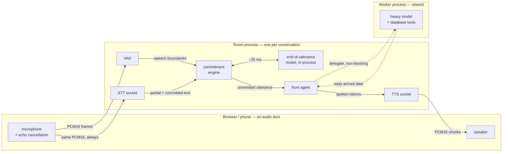
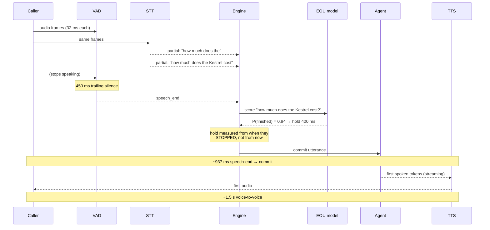
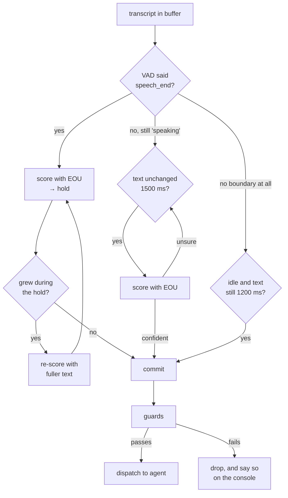
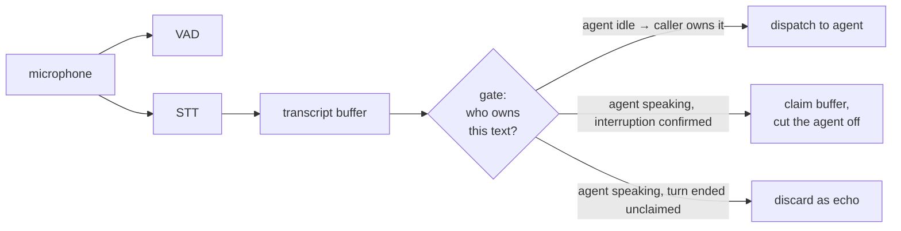
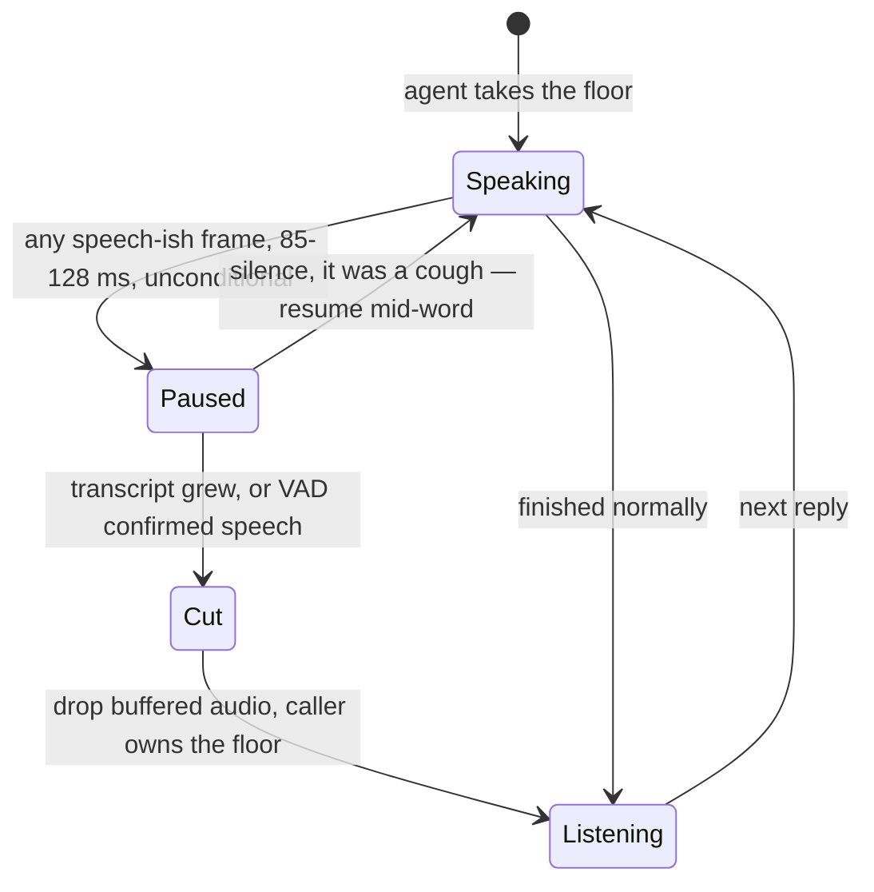

# Server-hosted voice rooms: a production design document

For engineers building a real-time voice agent on this pattern. It is
self-contained — you do not need to read the example's code or its README first.

Part I describes **what the system is and how it works**. Part II describes
**what must stay true when you rebuild it**, the failure modes that follow from
getting it wrong, and what in the reference implementation is deliberately
demo-grade.

Everything in Part II was found by debugging real calls. Almost all of it
presents identically from the caller's side — *the room stopped listening to me*
— so the symptom carries no information about the cause. That is what makes it
worth writing down.

---

# Part I — What this is

## 1. The problem

A voice agent has to do six things between a person finishing a sentence and
hearing a reply:

1. Decide there is a voice at all (**VAD**)
2. Turn audio into words (**STT**)
3. Decide the person is *finished* (**endpointing / turn-taking**)
4. Think of a reply (**the agent**)
5. Turn the reply into audio (**TTS**)
6. Stop instantly when the person starts talking again (**barge-in**)

Steps 3 and 6 are where voice agents feel broken. Steps 1, 2, 4 and 5 are mostly
vendor calls. The hard, product-defining engineering is *"has this person
finished talking, and what exactly did they say?"* — and every guard in Part II
exists to protect that question from a component that is confidently wrong.

## 2. Where the work lives

The decision that shapes everything else: **the client captures and plays audio,
and makes no decisions.** Every production voice platform converges on this
(LiveKit Agents, Pipecat, Vapi, Retell), for reasons that become concrete below.



**Why it matters that the room owns endpointing.** If the commitment engine runs
in the browser and the end-of-utterance model runs on a server, *every speech
boundary* costs an HTTP round trip — with a timeout, and a worse heuristic for
when the network is slow. In one process it is a ~25 ms function call. The same
move deletes per-session credential minting, and makes tuning a server config
change rather than a client deploy.

**The cost, stated honestly:** one extra network hop for audio (client → room →
vendor, instead of client → vendor). It roughly cancels against the round trips
deleted, and it buys everything above — including the ability to terminate a
phone call into the same room a browser connects to, because the session logic
cannot tell the difference.

## 3. Anatomy of a turn

Timings are measured on a live room, not estimated.



Two details in that diagram are load-bearing and easy to get wrong:

- **The hold is anchored to when the caller stopped**, not to when the decision
  was made. Anchoring it to "now" adds the scoring latency on top of the hold.
  Re-anchoring took a measured 1304 ms commit down to 722 ms.
- **The agent streams into TTS.** Audio starts on the first spoken token, not on
  the finished sentence.

## 4. The commitment engine

This is the component you will spend your time in. Its job: decide when the
buffered transcript becomes a turn.

It answers with **two models asking different questions.** The acoustic model
(VAD) decides *when to ask*. The semantic model (EOU) decides *how long to wait*.

```
hold = min_hold + (max_hold − min_hold) × (1 − P)^1.5
```

where `P` is the model's probability that the text is a finished thought. At the
defaults (400 ms / 2800 ms): a confident question holds 400 ms, a trailing
"so I was thinking…" holds well over two seconds.

### Four ways a turn commits

A single path is not enough, because in a real room the VAD can fail to produce
a boundary at all — a television is speech, so it can stay "speaking"
indefinitely; a bad model state can stop firing entirely.



`endpoint`/`hold` is the normal path. `stable` covers a VAD stuck on, `sweep`
covers a VAD that never fires — **a turn that never commits is a room gone
deaf**, which is the worst outcome available, so both fallbacks exist.

### The guards

Every commit passes four checks. Each exists because of a specific live failure
(see §9):

| Guard | Question | Rejects |
| --- | --- | --- |
| Freshness | Did anyone actually speak recently? | Hallucinations from silence |
| Near-field | Was it *this* caller? | The next table over |
| Prefix dedupe | Have we already sent these words? | Re-punctuated echoes of a sent line |
| Tail extension | Is this a correction or just lag? | Duplicate replies to one sentence |

## 5. Full duplex: the gate governs ownership, not the microphone

The single most consequential design decision, and the one most likely to be
"optimized" away by someone who did not have to debug it.



Audio **always** reaches both the VAD and the STT — including while the agent is
speaking. What the gate decides is what happens to the *text* produced during
the agent's turn.

Stop the audio instead, and the room is half-duplex: the caller can only
interrupt with noise, never with words. That matters because the strongest
available evidence of a real interruption is *words appearing in the transcript
while the agent holds the floor* — echo cancellation mangles the caller's audio
badly enough that a genuine interruption is often scored as noise by the VAD.
Cutting the audio throws away the best signal you have.

## 6. Barge-in is two decisions



**Stopping is free; committing is careful.** Pausing on the first hint of a voice
costs nothing if wrong — playback resumes mid-word. Cutting the turn discards
what the agent was saying, so it waits for evidence.

The retraction path is where this gets subtle: a VAD that calls a real
interruption a misfire will *resume the agent over the caller*, which reads as
the agent ignoring them. Transcript growth overrules the retraction.

## 7. Delegation: slow work without a silent room

A database lookup takes seconds. A conversation cannot wait seconds.

```mermaid
sequenceDiagram
    participant C as Caller
    participant A as Front agent
    participant W as Worker process

    C->>A: "how much does the Kestrel cost?"
    A->>W: delegate (non-blocking dispatch)
    A-->>C: "Let me check that for you." (same turn)
    Note over A: turn ends; room stays responsive
    C->>A: "and does it come with a warranty?"
    A-->>C: handles this normally
    W-->>A: result arrives (own schedule)
    A-->>C: relays the answer
```

The rule that makes this work: **the acknowledgement and the dispatch happen in
the same turn.** An agent that says "let me check" without actually dispatching
leaves the caller waiting forever, so the orchestrator watches for that and
nudges. The reply arrives as a separate wake-up, not as a return value.

---

# Part II — Building it to last

## 8. Invariants

Load-bearing. Each exists because violating it produced a bug that took a live
call to find.

### 8.1 Audio always flows; the gate governs ownership

See §5. This is first because it is the one most likely to be undone as an
optimization.

### 8.2 Never feed the recognizer synthetic audio

Whisper-family models hallucinate confidently on digital silence — "Yes.",
"Thank you.", "Bye." Any keepalive sending zero-filled frames manufactures
utterances nobody spoke, arriving indistinguishable from real ones.

If a socket needs warming, send real captured audio or let it reconnect. The
only safe window for synthetic frames is when **no caller is attached**.

### 8.3 No single model gets a veto

| Model | Actually answers | Does **not** answer |
| --- | --- | --- |
| VAD | is there a voice in this 32 ms frame | is it *my caller's* voice |
| Recognizer | what words are in this audio | whether anyone meant to say them |
| EOU | does this text sound finished | whether more is coming |

Each is wrong in its own conditions. Design against **one silently overruling a
better-informed one** — which is exactly what happened when an acoustic
threshold tuned for turn boundaries was reused to decide whether a transcript was
real. Where two signals disagree, prefer the one with better evidence *for that
specific question*, and make the disagreement observable.

### 8.4 Compare transcripts by words, never by characters

Recognizers re-punctuate settled text indefinitely, at roughly 1 Hz:

```
"Okay. Okay, thanks."  →  "Okay. Okay. Thanks."  →  back again
```

Any check written on raw strings — *has the transcript stopped changing?*, *have
we already sent this?* — eventually fires on a moving comma instead of on speech.
One such check held a finished sentence unsent for **13 seconds**; another
dispatched the same line twice and had the agent answer itself.

Normalize to words for every comparison; slice on word boundaries and return the
recognizer's own punctuation for the remainder.

### 8.5 Stopping is free, committing is careful

See §6.

### 8.6 Every state that can mute the caller needs an owner and a deadline

A pause with no matching resume leaves the client buffering silently for the rest
of the call. So does a playback-complete signal that never arrives because the
tab was backgrounded.

Each such state needs (a) one function that exits it, called from every terminal
path, and (b) a server-side watchdog that fires without client cooperation — here
playback end is derived from bytes already sent, so a silent client cannot strand
the room.

### 8.7 A dropped transcript must be visible

The highest-value entry on this list. Discarding transcript text is invisible from
outside: the recognizer logs the words, the room silently declines them, and what
you observe is a **working recognizer attached to an agent that stopped
answering.**

Every drop path prints the decision and the numbers behind it:

```
[turn] dropped as phantom (sweep, no voice for 4109ms): "This is a"
[turn] dropped as far_field (stable, 0.0120 rms vs 0.0769 for this caller): "…"
[turn] VAD scored nothing for 10501ms while the recognizer kept hearing words — resetting it
```

Two production bugs were diagnosed from a single call log within minutes of these
being added. Each had previously cost several rounds of live testing.

## 9. Failure taxonomy

Symptom → cause → guard. All observed live; all pinned by a regression check.

### Listening stack

| Symptom | Cause | Fix / guard |
| --- | --- | --- |
| Recognizer transcribes fine, room ignores every word, nothing reaches the UI | Freshness gate keyed to the VAD at the *turn-boundary* threshold; a quiet or distant talker never clears it | Two witnesses: much lower acoustic bar, plus growing transcript as evidence in its own right (`quiet-talker-check`) |
| Finished sentence sits unsent for many seconds | Stillness measured on raw strings; re-punctuation resets the clock | Normalize to words (`commit-latency-check`) |
| Same line dispatched twice; agent answers itself | Dedupe compared characters; a re-punctuated echo matched neither equality nor prefix, so it looked like fresh speech | Word-sequence prefix logic (`dedupe-check`) |
| Room goes deaf mid-call, never recovers, caller must hang up | Recurrent VAD state went bad; the gap-based reset can't fire because full duplex means audio never stops arriving | Watchdog: new words + no acoustic evidence for 10 s ⇒ reset the model (`commit-latency-check`) |
| Utterances nobody spoke | Synthetic silence keepalive fed to the recognizer | §8.2 |
| Two utterances glued together across callers | The recognizer's partial buffer is session-scoped, not connection-scoped, and survives detach | Commit the stale buffer on detach, mark it already-dispatched |
| Next table's conversation transcribed as the caller | No model in the stack answers "is this my caller" | Loudness relative to the caller's own learned level (`far-field-check`) |

### Barge-in

| Symptom | Cause | Fix / guard |
| --- | --- | --- |
| Agent pauses, then resumes the same sentence, ignoring the interruption | VAD scored the echo-mangled interruption a misfire and retracted a correct pause | Transcript growth overrules the retraction (`barge-escalation-check`) |
| After one interruption the room never responds again | Pause with no resume path; client stayed muted | Single exit function + byte-derived playback watchdog |
| Client's barge-in signal arrives after the agent already finished | Race, unavoidable | Decline gracefully with an explicit resume — never leave the client waiting |

### Process safety

| Symptom | Cause | Fix / guard |
| --- | --- | --- |
| Host process dies on a transient vendor 5xx | Auto-reconnect called an async function with no `.catch()`; unhandled rejection | Catch at every reconnect site; add a supervised revive loop |
| Stack overflow tearing down a speech socket | `destroy()` fires the socket's `error` event **synchronously**, whose handler tears down again | Clear references *before* destroying |
| Recognizer silently keeps buffering after an explicit commit | Vendor throttles commits under ~0.3 s of uncommitted audio; the rejection is invisible | Pad the flush past the vendor's floor |

### The agent

| Symptom | Cause | Fix / guard |
| --- | --- | --- |
| Agent greets a throat-clear, answers a mis-transcription, replies to the next table | Nothing told it the transcript is an unreliable witness | Prompt: silence is the most-used response, not a fallback |
| Agent repeats a price the *customer* invented as though the business quoted it | Nothing distinguished "heard" from "known" | Only tool-sourced facts exist |
| One unclear word resolved into a confident proper noun | Model filling a gap plausibly | Ask; never resolve |

## 10. What is demo-grade in the reference implementation

Read before shipping. None are hidden; all are deliberate simplifications.

**The room WebSocket is unauthenticated.** Anything that can reach the port can
attach to the call, and a second connection *replaces* the first. Production
needs a per-room capability token minted with the room and verified on upgrade.
The most important gap here.

**Transcripts live in memory and die with the process.** No persistence, no
resume after a crash, no record of the call. If your product needs history — most
do, some are legally required to keep it — that is a real store and schema.

**Metrics append to a local file.** Fine for one host, useless across a fleet.
Note the drop warnings in §8.7 contain **caller speech**: treat them as user data
when routing logs, and consider truncating or hashing.

**Ports are allocated by probing for a free one.** Races under concurrency. Use a
real allocator, or terminate every room on one multiplexed gateway and route by
room id.

**One vendor key for everything.** No per-tenant quota, attribution or isolation.
Multi-tenant needs at minimum a spend cap per room — a stuck room is a metered
socket held open.

**Capacity is a slot count per host (default 4).** Each room is a process holding
an ONNX model and two vendor sockets. Plan against process count and model
memory, not request rate.

**Nothing handles recording consent or data residency.** Voice is regulated
differently from text in many jurisdictions — a launch decision, not a retrofit.

**Cold start is real.** The EOU model takes ~1.3 s to load. Rooms warm it before
the caller attaches; spawn-on-demand pays it on the first call unless pre-warmed.

## 11. Tuning surface

All server-side — most of the point of hosting the pipeline there.

| Knob | Default | Raise when | Lower when |
| --- | --- | --- | --- |
| `VAD_POSITIVE` / `VAD_NEGATIVE` | 0.35 / 0.25 | False starts in a noisy room | The caller must raise their voice to be heard |
| `VAD_SILENCE_MS` | 450 | Callers cut off mid-thought | Turns feel sluggish |
| `TURN_MIN_HOLD_MS` | 400 | — | Rarely — it sits deliberately above VAD resume detection so a fast follow-on can cancel a commit in flight |
| `TURN_MAX_HOLD_MS` | 2800 | Deliberate, pausing speakers | Callers wait too long after finishing |
| `FAR_FIELD_RATIO` | 0.25 | Stricter in a crowd (→0.4) | A soft-spoken caller is cut (→0.1); `0` disables |
| `FRONT_MODEL` | fast tier | — | See §12 |
| `FRONT_PROVIDER_SORT` | throughput | — | Measured 6× TTFT difference on identical weights |
| `ROOM_SLOTS` / `ROOM_MAX_MS` | 4 / 1 h | Capacity planning | — |

The client keeps exactly one knob: microphone **AGC, default off**. Automatic
gain control exists to make every voice arrive at the same level, and relative
level is the only cue separating the caller from the room around them.

## 12. Choosing the front model

The front agent's job is judgment under time pressure: decide whether a line was
even addressed to it, and start speaking fast enough to feel conversational.
Those goals are in tension — measure rather than assume.

A rubric harness runs cases taken from real call transcripts over the room's own
text-injection path, scoring **silence** (correctly saying nothing) separately
and weighting it hardest, because an agent talking over a room it misheard is the
failure callers feel most.

| Model | Silence | First spoken token |
| --- | --- | --- |
| Fast tier (Groq-served) | 2/5 | **313 ms** |
| Mid tier | 4/5 | 1853 ms |
| Strong tier | 5/5 | 3213 ms |

Two findings that generalize:

- **A better prompt does not fix a model that won't follow it.** The defensive
  prompt barely moved the fast model's score, and produced near-verbatim intended
  behaviour on a stronger one.
- **Serving matters more than weights for latency.** Most of that spread is
  provider availability, not capability.

Rooms accept a per-run model override so candidates can be A/B'd without a
restart.

## 13. Testing what a simulator cannot reach

Most bugs in §9 are invisible to end-to-end audio tests, structurally:
**attenuating clean synthesized speech is not the same as a real room.** At 4 %
gain the VAD still scores synthesized speech 0.999 — the condition that broke
production does not exist in the simulation.

So the suite has two layers:

**Logic checks** drive the engine directly with a fake recognizer and a
hand-driven VAD, reproducing conditions a microphone cannot be made to produce on
demand: a VAD that never fires a boundary, a recognizer that re-punctuates
forever, a VAD that dies mid-call. Each was verified to **fail against the
previous engine** — that is what makes it a regression test rather than a
description.

**Live sims** stream real synthesized speech into a real room and measure
end-to-end: commit latency, voice-to-voice, barge-in, phantom counts over
silence.

Port the logic checks first. They are the cheap layer and they cover the
expensive bugs.

## 14. If you remember four things

1. **Audio always flows; gate ownership, not the microphone.**
2. **Compare words, not characters** — recognizers re-punctuate forever.
3. **Make every drop loud**, or you will debug a working recognizer attached to a
   mute agent.
4. **Being ignored is worse than overhearing.** Every guard here is tuned to err
   toward hearing the caller — including the ones that recover automatically once
   they notice they have been wrong for too long.
